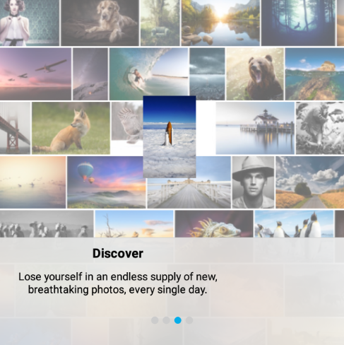

# Android的模糊视图

## 模糊效果 

模糊效果可以生动的表达内容分层的含义。它允许用户保留上下文，同时专注于当前的特色内容，即使在模糊表面下以视差方式变换或动态的更改。 

在 iOS 中，我们可以通过首先构建一个 `UIVisualEffectView` 来得到这种模糊：
  
```
    UIVisualEffect *blurEffect = [UIBlurEffect effectWithStyle:UIBlurEffectStyleLight];
    UIVisualEffectView *visualEffectView = [[UIVisualEffectView alloc] initWithEffect:blurEffect]
```

然后添加 `visualEffectView` 到视图层次中，在视图层次中它会动态的模糊它下面的东西。 

## Android当前发展状况 

当事情并不像 Android 上那么简单时，我们确实看到了模糊效果的很好的例子，如 Yahoo 天气应用程序。根据 [Nicholas Pomepuy’s blog post](http://nicolaspomepuy.fr/blur-effect-for-android-design/)，然而，这里的模糊是通过缓存背景图像的 pre-render 模糊版本得到的。 

虽然这种方法非常有效，但是它并不完全适合我们的需要。[500 像素](https://500px.com/)的图像通常是重点内容，而不仅仅用于提供背景。那就意味着图像可能会改变很多，变化很快，即使它们在模糊层下。[Android 应用程序](https://play.google.com/store/apps/details?id=com.fivehundredpx.viewer)中的 tour 就是一个很好的例子。在这里，随着用户滑动页面，一排排的图片向相反的方向转变，并淡出，这使得为组合所需的模糊效果而恰当的管理多个预渲染图像变得非常困难。 

 

## 试图绘制方法 

Tour 需要的是一个模糊视图，它能够动态的实时的模糊它下面的视图。我们最终到达的接口非常简单，就如首次给定模糊视图一个引用那样：
 
```
    blurringView.setBlurredView(blurredView); 
```

然后每当模糊视图变化时——无论由于内容变化(如显示一个新的照片)，视图转换，或动画的一个步骤，模糊视图都将无效：

```
    blurringView.invalidate(); 
```

为了实现模糊视图，我们可以生成 `View` 类的子类，并覆盖 `onDraw()` 方法来呈现模糊效果： 

```
    protected void onDraw(Canvas canvas) {
    	super.onDraw(canvas);

    	// Use the blurred view’s draw() method to draw on a private canvas.
    	mBlurredView.draw(mBlurringCanvas);

    	// Blur the bitmap backing the private canvas into mBlurredBitmap
    	blur();

    	// Draw mBlurredBitmap with transformations on the blurring view’s main canvas.
    	canvas.save();
    	canvas.translate(mBlurredView.getX() - getX(), mBlurredView.getY() - getY());
    	canvas.scale(DOWNSAMPLE_FACTOR, DOWNSAMPLE_FACTOR);
    	canvas.drawBitmap(mBlurredBitmap, 0, 0, null);
    	canvas.restore();
    } 
```

这里的关键是当模糊视图重绘时，它使用模糊视图的 `draw()` 方法，它有一个参考，但是会画到一个私有的，bitmap-backed 画布上：
  
```
    mBlurredView.draw(mBlurringCanvas);
```

(值得注意的是，这种调用另一种视图的 `draw()` 方法的方式也适用于构建一个 magnifier 或signature UI，其中 magnifier 的内容或 signature 的面积是扩大的，而不是模糊的。) 

按照在 [Nicholas Pomepuy’s post](http://nicolaspomepuy.fr/blur-effect-for-android-design/) 中讨论的观点，我们使用二次抽样的组合以及 [RenderScript](http://developer.android.com/guide/topics/renderscript/compute.html) 来快速处理。当我们初始化模糊视图的私有画布 `mBlurringCanvas` 时，二次抽样的设置就完成了： 

```
    int scaledWidth = mBlurredView.getWidth() / DOWNSAMPLE_FACTOR;
    int scaledHeight = mBlurredView.getHeight() / DOWNSAMPLE_FACTOR;

    mBitmapToBlur = Bitmap.createBitmap(scaledWidth, scaledHeight, Bitmap.Config.ARGB_8888);
    mBlurringCanvas = new Canvas(mBitmapToBlur);
```

鉴于对 RenderScript 的设置和适当地初始化，用于 `onDraw()` 中的 `blur()` 方法非常简单，如下所示：

```
    mBlurInput.copyFrom(mBitmapToBlur);
    mBlurScript.setInput(mBlurInput);
    mBlurScript.forEach(mBlurOutput);
    mBlurOutput.copyTo(mBlurredBitmap); 
```

现在 `mBlurredBitmap` 已经准备好了，剩下的 `onDraw()` 方法负责使用适当平移和缩放的方式，把它画入模糊视图的画布中。 

## 实现细节

对于一个完整的实现，我们需要注意几个技术点。首先，我们发现 8 倍的 downsampling 缩放和 15 的模糊半径对我们更有利。适合于你的参数可能会不同。 

第二，我们在模糊位图的边缘发现了一些 RenderScript 工件。为了辨识这些，我们将 scaled 的宽度和高度提高到最近的 4 的倍数：

```
    // The rounding-off here is for suppressing RenderScript artifacts at the edge.
    scaledWidth = scaledWidth - (scaledWidth % 4) + 4;
    scaledHeight = scaledHeight - (scaledHeight % 4) + 4;
```

第三，为了进一步确保良好的性能，我们创建了两个位图 `mBitmapToBlur`，支持私有画布 `mBlurringCanvas`,和 `mBlurredBitmap` 需求，并且只有当模糊视图的大小发生变化时，才需要重建它们。同样地，只有在模糊视图的大小发生变化时，我们才创建 `RenderScript` 的  `Allocation` 对象 `mBlurInput` 和 `mBlurOutput`。 

第四，我们也用 `PorterDuff.Mode.OVERLAY` 在模糊图像的顶部画一层均匀的，半透明的白色来突出我们的设计需求。 

最后，因为 RenderScript 只在 API level 17 及更高的版本上可用，我们需要在 Android 旧版本上完全降低。不幸的是，正如 [Nicholas Pomepuy’s post](http://nicolaspomepuy.fr/blur-effect-for-android-design/) 中提到的，Java中的位图模糊解决方案，虽然适合于预呈现一个缓存副本，但是实时渲染不够快。我们作出的决定是简单地使用一个具有高透明度的半透明视图作为候选。(2015 年 3 月 23 日更新：通过使用 [RenderScript](http://android-developers.blogspot.ca/2013/09/renderscript-in-android-support-library.html) 支持库，可以更低水平的 API 下使用我们的解决方案。以下提到的库和样例已经更新，以反映这一点。感谢 GitHub 用户 [panzerdev](https://github.com/panzerdev) 指出这一点，并发送了请求。) 

## 优点和缺点 

我们喜欢这个视图绘图方法因为它是实时模糊的，容易使用，它允许模糊视图内容的不可知性，它还允许模糊和模糊视图之间关系的灵活性，最重要的是，它适合我们的需要。 

然而,这种方法确实期望模糊视图参与适当的坐标变换的模糊视图的下落。相应地,在模糊视图不能是模糊视图的子视图,否则你会从相互嵌套调用得到一个堆栈溢出。这种限制下一个简单的原则是确保这个模糊视图是 z 值在它前面的模糊视图的同层。 

我们已经注意到的另一个限制是矢量图和文本，如果我们使用默认的位图downsampling，它们不能很好的起作用。 

## 库和样例 

为了看到我们的解决方案，你可以查看 [Android 应用程序](https://play.google.com/store/apps/details?id=com.fivehundredpx.viewer)中的 tour。我们也在 [GitHub 中](https://github.com/500px/500px-android-blur)建立一个小型的开源库，以及详细演示,展示了内容变化，动画以及视图转换的使用方法。

