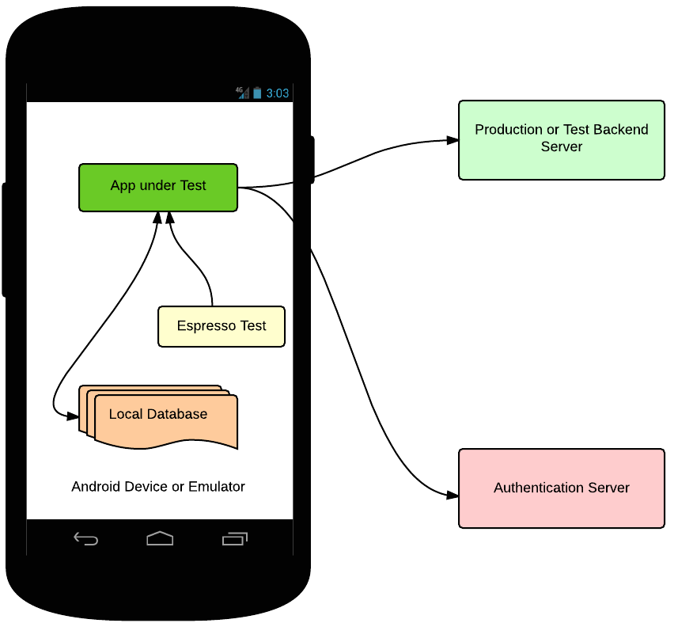
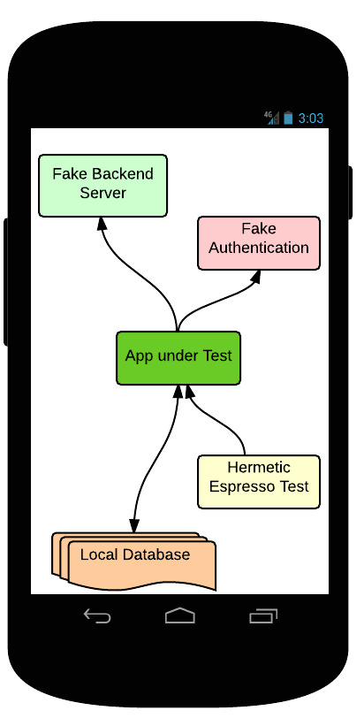
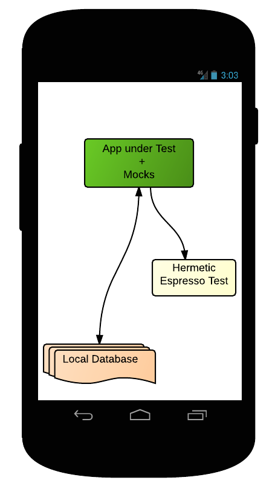
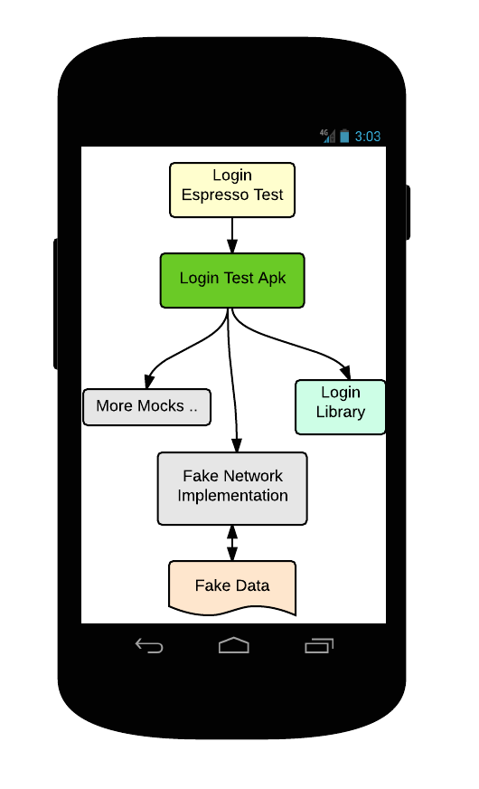
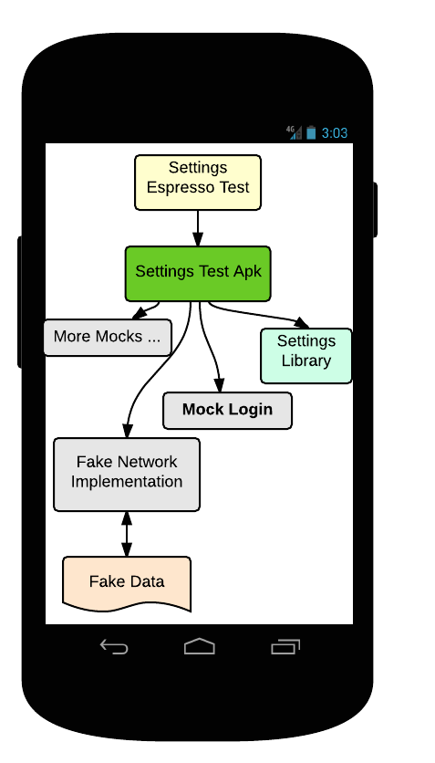

# Android UI 自动化测试
## 概述
这篇文章回顾了 Android UI 测试的四个策略，目的是创建快速、可靠和容易调试的 UI 测试。 

开始之前，请不要忘记导入的规则：可以单元测试的要单元测试。Robolectric 和 gradle unit tests support 就是 Android 单元测试框架的很好的例子。UI 测试，从另一方面来说，是用来验证你的应用程序能否返回与设备中一系列的用户动作相呼应的正确的 UI 输出。Espresso 是一个很好的框架，用来在同一进程中运行 UI 操作和验证。更多关于 Espresso 和 UI Automator 工具，请参阅：test support libraries。 

Google+ 团队实现许多 UI 测试的迭代。接下来我们讨论在每一个 UI 测试的策略中的经验教训。请继续关注带有更多的细节和代码示例的文章。 

### 策略1：使用端对端的测试作为UI测试 

让我们从一些定义开始。UI测试确保你的应用程序会返回与设备中一系列的用户动作相呼应的正确的 UI 输出。端对端(E2E)测试提出了应用程序的全系统服务，包括所有后端服务器和客户端应用程序。E2E 测试将保证数据正确地发送到客户端应用程序,保证整个系统正确地运行。 

通常，为了使应用程序 UI 功能化，你需要来自后端服务器的数据，所以 U I测试需要模拟数据，但不一定必需从后端服务器模拟。在许多情况下，U I测试与 E2E 测试混淆，这是因为 E2E 测试非常类似于手动测试场景。然而，由于许多变量的存在，如网络薄片，真实服务器的认证，系统的大小等等，使调试 E2E 测试及使 E2E 测试稳定非常困难。 

 

当你将 UI 测试用作 E2E 测试时，你将面临以下的问题： 

- 非常庞大以及缓慢的测试。
- 由于超时和内存问题导致的高片状率。
- 认证问题(如：自动化测试的认证是非常棘手的) 

让我们看看使用以下策略是怎样修复这些问题的。 

### 策略2：密封的UI测试使用假的服务器 

在这个策略中，你避免了使用网络电话和外部依赖，但是你需要提供你的应用程序和驱动UI的数据。更新你的应用程序使它与本地服务器而不是外地服务器来通信，并创建一个假的服务器，它能够为你的应用程序提供数据。接下来，你需要一种机制通来生成你的应用程序所需的数据。这可以通过使用不同的方法来实现，你使用的方法取决于你的系统设计。一种方法是记录服务器响应，并在假的服务器中回放这些服务器响应。 

一旦你将密封的 UI 测试与本地假的服务器相连，那么你也应该进行 server hermetic tests。这样你把你的 E2E 测试划分为一个服务器端测试，一个客户端测试和一个集成测试，来验证服务器和客户是否同步(关于集成测试更多的细节，请参阅 blog 的后端测试部分)。 

现在，客户端测试流看起来如下所示： 

 

虽然这种方法大大减小了测试规模和片状率，但是你仍然为你的测试保留一个单独的假服务器。调试仍然不容易，因为有两个移动的部分：测试和本地服务器。虽然通过这种方法，测试稳定性会大大的提高，但是本地服务期会导致一些薄片。 

让我们看看这一问题如何改善… 

### 策略3：应用程序的依赖注入设计 

为了删除运行在 Android 中假服务器的额外的依赖，你需要在应用程序中使用依赖注入，用真实的模块实现来交换假的。例如 Dagger，或者如果需要的话，你可以创建你自己的依赖注入。 

这将提高你的应用程序的单元测试和 UI 测试的可测试性。为你提供有模拟依赖关系的能力的测试。在 instrumentation testing 中，测试程序和被测试的应用程序被装载在同一进程中，所以测试代码运行时访问应用程序的代码。不仅如此，你还可以使用类路径覆盖(事实是测试类路径优先于被测试的应用程序)来覆盖某一类或在那里注入虚伪。例如，为了使你的测试密封，你的应用程序应该支持网络实现的注入。在测试过程中，测试在你的应用程序中注入一个假的网络实现，这个假的实现将提供成熟的数据，而不是与后端服务器进行通信。 

 

### 策略4：在更小的库中构建应用程序 

如果你想将你的应用程序扩展到许多模块和视图中，并计划添加更多的功能，同时保持稳定性和快速构建/测试，那么你应该在小组件/库中构建应用程序。每个库应该有自己的UI资源和用户依赖关系管理。这种策略不仅使为密封测试而构建的库的模拟依赖关系成为可能，并且能够作为你应用程序的各种组件的实验平台来服务。 

一旦你有依赖注入支持的小组件，你就可以为每个组件构建一个测试应用程序。 

测试应用程序提供了库的实际 UI，需要的假数据，以及模拟依赖关系。Espresso 测试将针对这些测试应用程序运行。这使得在隔离条件下测试更小的库成为可能。 

例如，我们可以考虑为登录和应用程序的设置构建更小的库。 

 

现在，设置组件测试看起来如下所示： 

  

## 总结 

为 Android 中大量应用程序进行 UI 测试是非常具有挑战性的。关于 Google+ 团队，这里有一些 UI 测试的经验教训： 

1. 不要用 E2E 测试来代替UI测试。除了 UI 测试，还可以写入单元测试和集成测试。
2. 可以采用密封测试的方式。
3. 在设计你的应用程序时，使用依赖注入。
4. 在小库/模块中构建你的应用程序，并单独进行测试。然后你可以得到一些集成测试来验证组件间的集成是否正确。
5. 组件化的 UI 测试被证明比 E2E 快的多，并且比它稳定 99%+。快速性和稳定性测试证明大大提高开发人员的生产力。
