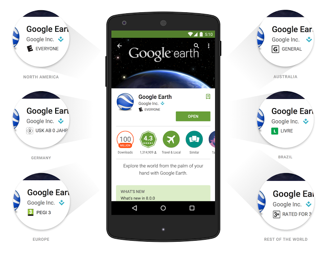

# 在谷歌市场上创造更好的用户体验 

不管它是一种[跟踪训练的方法](https://play.google.com/store/apps/details?id=com.fitnesskeeper.runkeeper.pro)，[chart the nighttime stars](https://play.google.com/store/apps/details?id=com.escapistgames.starchart) ，或是 [build a new reality](https://play.google.com/store/apps/details?id=com.supercell.clashofclans)，争夺世界霸权，谷歌市场为开发人员提供了一个创建引人入胜的应用程序和游戏的平台，从而打造一个成功的企业。关键的任务是用户在谷歌市场上搜索应用程序和游戏的时候可以享受到一种积极地体验。现在我们利用两个更新来提升开发人员和用户的体验。

### 一种基于行业标准的全球内容分级系统 

今天，在谷歌市场上针对应用程序和游戏，我们要介绍一种新的基于年龄的分级系统。我们都知道，对于什么样的内容适合孩子、青少年和成年人，来自不同国家的人们都有不同的想法。所以今天的这个声明将帮助开发人员针对不同的使用者来更好地标记应用程序。与行业最佳标准相一致，这种改变不仅将为开发人员和他们的用户进行沟通熟悉以及对本地内容进行分级提供一种简便的方法，并且通过让用户选择适合他们的内容，有助于改善应用程序的发现的参与。 

从现在开始，开发人员可以对他们的每一个应用程序和游戏完成一份内容分级问卷调查来获取客观的内容分级结果。谷歌市场的新分级系统是来自国际年龄分级联盟（IARC）及其参与机构的官方分级，包括娱乐软件分级委员会（ESRB），全欧洲的游戏信息组织（PEGI），澳大利亚分类委员会，娱乐软件协会（USK），分级系统（ClassInd）。不受特定权威分级覆盖的区域将显示一个机遇年龄的一般的分级。这个过程对开发人员是快速、自动而且免费的。在未来的几周里，来自全球的消费者将可以在他们本地的市场里开始看到这些新的分级系统。 

在谷歌市场里为了帮助维护你的应用程序的可用性，可以[登录到开发人员控制台](http://play.google.com/apps/publish/)并为你的每个应用程序完成一份新的分级问卷调查。没有一份完整的分级问卷调查的应用程序将被标记为“未分级”，并且可能会在某些区域被封锁或者被用于特定用户。从五月份开始，所有新的应用程序以及现有应用程序中的更新在谷歌市场里可以被发布之前都将需要一份完成的问卷调查。

 

### 一个更好的保护用户的应用程序审查过程 

几个月前，为了更好的保护社区和改善应用程序的目录，应用程序在谷歌市场里被发布之前，我们开始对他们进行审查。这个新的过程设计一个专家小组，他们主要主责识别哪些违反开发政策的行为，这些 [developer policies](https://play.google.com/about/developer-content-policy.html) 比应用程序的生命周期还要早。我们看重的是谷歌市场里唯一快速的创新和更迭，并且将继续帮助开发人员将他们的产品在被提交之后几个小时之内推向市场，而不是等到几天或者几周之后。实际上，在部署的过程中对于开发人员并没有明显的变化。 

为了协助这项工作，并未开发人员提供更大的透明度，我们还推出了在处理发布 [status](https://support.google.com/googleplay/android-developer/answer/113469) 上的改进方法。开发人员可以更深入的了解为什么应用程序会被拒绝或暂停，并且如果轻微的违反政策，他们可以很容易的修复并重新提交他们的应用程序。 

在过去的一年中，我们已经为开发人员支付了超过 70 亿美元，并且很高兴看到生态系统的发展与创新。我们将继续开发新的工具和服务来促进这一增长，并帮助开发者社区构建成功的企业。
