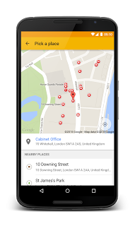

# 欢迎为 Android 和 iOS 嵌入 API 

由 Jen Kovnats Harrington 发布，谷歌地图API的产品经理 

最初[发布](http://googlegeodevelopers.blogspot.com/2015/03/hello-places-api-for-android-and-ios.html)到谷歌地图开发人员的博客 

人们不认为他们的位置是在地图的坐标上。他们想象的环境是他们在什么商店或者餐馆，周围有些什么。为了帮助你的应用程序可以讲出用户所使用的语言，我们正针对 [Places API for Android](https://developers.google.com/places/android?utm_campaign=placesapi-315&utm_source=dac&utm_medium=blog) 和 [Places API for iOS](https://developers.google.com/places/ios?utm_campaign=placesapi-315&utm_source=dac&utm_medium=blog) 开放一个测试程序。 

Places API 的 [web 服务](https://developers.google.com/places/webservice/?utm_campaign=placesapi-315&utm_source=dac&utm_medium=blog)和 [JavaScript 库](https://developers.google.com/places/javascript/?utm_campaign=placesapi-315&utm_source=dac&utm_medium=blog)可以使用已经有一段时间了。通过对 Android 和 iOS 设备提供本地支持，您可以通过新的 APIs 利用设备的位置信号来优化移动体验。 

Android 和 iOS 的 Places API 为简单表示地理位置的经度和纬度缩短了距离，以及人们如何与一个已经的地方进行定位。例如，你不会告诉别人你出生在 25.7918359，-80.2127959。你只需要简单地说，“我出生在迈阿密的杰克逊纪念医院，位于佛洛里达州。”Places API 将谷歌全球的位置数据库加载到你的应用程序中，提供了超过 1 亿个地方，如餐馆、当地的商业、酒店、博物馆和其他景点。 

主要功能包括： 

- 添加一个**地点选择器**：一个下拉式的 UI 控件，允许你的用户指定地方。
- **获取**用户现在所在的**位置**
- **显示详细的位置信息**，包括地方名称、地址、电话号码和网站
- 使用**自动**完成来保存用户的时间和拼写的地点名称，根据它们的类型自动完成。
- 通过**添加**与用户相关的**新的地方**并在谷歌位置数据库中显示这些地方来使你的应用程序脱颖而出。
- 通过**报告**设备在某一个特定的地点来改善你周围的地图。 

为了在 Android 上开始使用 Places API，查看 [DevByte](https://www.youtube.com/watch?v=xPo3gfTXXOQ),检查[开发文档](https://developers.google.com/places/android?utm_campaign=placesapi-315&utm_source=dac&utm_medium=blog)，并演示播放。为了在 iOS 测试程序上申请应用 Places API，看[这里](https://developers.google.com/places/ios/?utm_campaign=placesapi-315&utm_source=dac&utm_medium=blog)。

 

