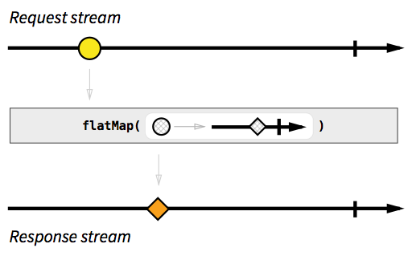

# 响应式编程（Reactive Programming）介绍

很明显你是有兴趣学习这种被称作响应式编程的新技术才来看这篇文章的。 

学习响应式编程是很困难的一个过程，特别是在缺乏优秀资料的前提下。刚开始学习时，我试过去找一些教程，并找到了为数不多的实用教程，但是它们都流于表面，从没有围绕响应式编程构建起一个完整的知识体系。库的文档往往也无法帮助你去了解它的函数。不信的话可以看一下这个：  

>通过合并元素的指针，将每一个可观察的元素序列放射到一个新的可观察的序列中，然后将多个可观察的序列中的一个转换成一个只从最近的可观察序列中产生值得可观察的序列。

天啊。 

我看过两本书，一本只是讲述了一些概念，而另一本则纠结于如何使用响应式编程库。我最终放弃了这种痛苦的学习方式，决定在开发中一边使用响应式编程，一边理解它。在 [Futurice](https://www.futurice.com/) 工作期间，我尝试在真实项目中使用响应式编程，并且当我遇到困难时，得到了同事们的帮助。 

在学习过程中最困难的一部分是 以**响应式编程的方式思考** 。这意味着要放弃命令式且带状态的编程习惯，并且要强迫你的大脑以一种不同的方式去工作。在互联网上我找不到任何关于这方面的教程，而我觉得这世界需要一份关于怎么以响应式编程的方式思考的实用教程，这样你就有足够的资料去起步。库的文档无法为你的学习提供指引，而我希望这篇文章可以。

## “什么是响应式编程?”  

在互联网上有着一大堆糟糕的解释与定义。[Wikipedia](https://en.wikipedia.org/wiki/Reactive_programming) 一如既往的空泛与理论化。[Stackoverflow](http://stackoverflow.com/questions/1028250/what-is-functional-reactive-programming) 的权威答案明显不适合初学者。[Reactive Manifesto](http://www.reactivemanifesto.org/) 看起来是你展示给你公司的项目经理或者老板们看的东西。微软的 [Rx terminology](https://rx.codeplex.com/) "Rx = Observables + LINQ + Schedulers" 过于重量级且微软味十足，只会让大部分人困惑。相对于你所使用的 MV* 框架以及钟爱的编程语言，"Reactive" 和 "Propagation of change" 这些术语并没有传达任何有意义的概念。框架的 Views 层当然要对 Models 层作出反应，改变当然会传播。如果没有这些，就没有东西会被渲染了。 

所以不要再扯这些废话了。 

### 响应式编程是使用异步数据流进行编程 

一方面，这并不是什么新东西。Event buses 或者 Click events 本质上就是异步事件流，你可以监听并处理这些事件。响应式编程的思路大概如下：你可以用包括 Click 和 Hover 事件在内的任何东西创建 Data stream。Stream 廉价且常见，任何东西都可以是一个 Stream：变量、用户输入、属性、Cache、数据结构等等。举个例子，想像一下你的 Twitter feed 就像是 Click events 那样的 Data stream，你可以监听它并相应的作出响应。 

**在这个基础上，你还有令人惊艳的函数去组合、创建、过滤这些 Streams。**这就是函数式魔法的用武之地。Stream 能接受一个，甚至多个 Stream 为输入。你可以融合两个 Stream，也可以从一个 Stream 中过滤出你感兴趣的 Events 以生成一个新的 Stream，还可以把一个 Stream 中的数据值 映射到一个新的 Stream 中。 

既然 Stream 在响应式编程中如此重要，那么我们就应该好好的了解它们，就从我们熟悉的"Clicks on a button" Event stream 开始。

 

Stream 就是一个**按时间排序的 Events 序列**,它可以放射三种不同的 Events：(某种类型的)Value、Error 或者一个" Completed" Signal。考虑一下"Completed"发生的时机，例如，当包含这个按钮的窗口或者视图被关闭时。 

通过分别为 Value、Error、"Completed"定义事件处理函数，我们将会**异步地**捕获这些 Events。有时可以忽略 Error 与"Completed"，你只需要定义 Value 的事件处理函数就行。监听一个 Stream 也被称作是订阅 ，而我们所定义的函数就是观察者，Stream则是被观察者，其实就是 [Observer Design Pattern](https://en.wikipedia.org/wiki/Observer_pattern)。 

上面的示意图也可以使用ASCII重画为下图，在下面的部分教程中我们会使用这幅图： 

```
    --a---b-c---d---X---|->

    a, b, c, d are emitted values
    X is an error
    | is the 'completed' signal
    ---> is the timeline 
```

既然已经开始对响应式编程感到熟悉，为了不让你觉得无聊，我们可以尝试做一些新东西：我们将会把一个 Click event stream 转为新的 Click event stream。 

首先，让我们做一个能记录一个按钮点击了多少次的计数器 Stream。在常见的响应式编程库中，每个Stream都会有多个方法，如 `map`, `filter`, `scan`, 等等。当你调用其中一个方法时，例如  `clickStream.map(f)`，它就会基于原来的 Click stream 返回一个**新的 Stream** 。它不会对原来的 Click steam 作任何修改。这个特性称为**不可变性**,它对于响应式编程 Stream，就如果汁对于薄煎饼。我们也可以对方法进行链式调用，如 `clickStream.map(f).scan(g)`：
  
```
    clickStream: ---c----c--c----c------c-->
               vvvvv map(c becomes 1) vvvv
               ---1----1--1----1------1-->
               vvvvvvvvv scan(+) vvvvvvvvv
    counterStream: ---1----2--3----4------5--> 
```

`map(f)` 会根据你提供的 `f` 函数把原 Stream 中的 Value 分别映射到新的 Stream 中。在我们的例子中，我们把每一次 Click 都映射为数字 1。`scan(g)` 会根据你提供的 `g` 函数把 Stream 中的所有 Value 聚合成一个 Value `x = g(accumulated, current)` ，这个示例中 `g` 只是一个简单的添加函数。然后，每 Click 一次， `counterStream` 就会把点击的总次数发给它的观察者。 

为了展示响应式编程真正的实力，让我们假设你想得到一个包含“双击”事件的 Stream。为了让它更加有趣，假设我们想要的这个 Stream 要同时考虑三击(Triple clicks)，或者更加宽泛，连击(两次或更多)。深呼吸一下，然后想像一下在传统的命令式且带状态的方式中你会怎么实现。我敢打赌代码会像一堆乱麻，并且会使用一些变量保存状态，同时也有一些计算时间间隔的代码。 

而在响应式编程中，这个功能的实现就非常简单。事实上，这逻辑只有 [4 行代码](http://jsfiddle.net/staltz/4gGgs/27/)。但现在我们先不管那些代码。用图表的方式思考是理解怎样构建Stream的最好方法，无论你是初学者还是专家。

 

灰色的方框是用来转换 Stream 函数的。首先，简而言之，我们把连续 250 ms 内的 Click 都积累到一个列表中（就是 `buffer(stream.throttle(250ms)` 做的事。不要在意这些细节，我们只是展示一下响应式编程而已)。结果是一个列表的 Stream ，然后我们使用 `map()` 把每个列表映射为一个整数，即它的长度。最终，我们使用 `filter(x >= 2)` 把整数 1 给过滤掉。就这样，3 个操作就生成了我们想要的 Stream。然后我们就可以订阅(“监听”)这个 Stream，并以我们所希望的方式作出反应。 

我希望你能感受到这个示例的优美之处。这个示例只是冰山一角：你可以把同样的操作应用到不同种类的 Stream 上，例如，一个 API 响应的 Stream；另一方面，还有很多其它可用的函数。 

## “为什么我要使用响应式编程(RP)？” 

响应式编程提高了代码的抽象层级，所以你可以只关注定义了业务逻辑的那些相互依赖的事件，而非纠缠于大量的实现细节。RP 的代码往往会更加简明。 

特别是在开发现在这些有着大量与数据事件相关的 UI events 的高互动性 Webapps、手机 apps 的时候，RP 的优势就更加明显。10年前，网页的交互就只是提交一个很长的表单到后端，而在前端只产生简单的渲染。Apps 就表现得更加的实时了：修改一个表单域就能自动地把修改后的值保存到后端，为一些内容"点赞"时，会实时的反应到其它在线用户那里等等。
 
现在的 Apps 有着大量各种各样的实时 Events，以给用户提供一个交互性较高的体验。我们需要工具去应对这个变化，而响应式编程就是一个答案。 

## 以 RP 方式思考的例子 

让我们做一些实践。一个真实的例子一步一步的指导我们以 RP 的方式思考。不是虚构的例子，也没有只解释了一半的概念。学完教程之后，我们将写出真实可用的代码，并做到知其然，知其所以然。 

在这个教程中，我将会使用 **JavaScript** 和 [RxJS](https://github.com/Reactive-Extensions/RxJS) 作为工具 ，因为JavaScript是现在最多人会的语言，而 [Rx* library family](http://www.reactivex.io/) 有多种语言版本，并支持多种平台([.NET](https://rx.codeplex.com/), [Java](https://github.com/Netflix/RxJava), Scala, Clojure, [JavaScript](https://github.com/Reactive-Extensions/RxJS), [Ruby](https://github.com/Reactive-Extensions/Rx.rb), [Python](https://github.com/Reactive-Extensions/RxPy), [C++](https://github.com/Reactive-Extensions/RxCpp), [Objective-C/Cocoa](https://github.com/ReactiveCocoa/ReactiveCocoa), Groovy等等)。所以，无论你用的是什么工具，你都能从下面这个教程中受益。 

## 实现"Who to follow"推荐界面 

在 Twitter 上，这个表明其他账户的 UI 元素看起来是这样的：

 

我们将会重点模拟它的核心功能，如下： 

- 启动时从 API 那里加载帐户数据，并显示 3 个推荐
- 点击"Refresh"时，加载另外 3 个推荐用户到这三行中
- 点击帐户所在行的'x'按钮时，只清除那一个推荐然后显示一个新的推荐
- 每行都会显示帐户的头像，以及他们主页的链接 

我们可以忽略其它的特性和按钮，因为它们是次要的。同时，因为 Twitter 最近关闭了对非授权用户的 API，我们将会为 Github 实现这个推荐界面，而非 Twitter。这是[Github获取用户的API](https://developer.github.com/v3/users/#get-all-users)。 

如果你想先看一下最终效果，这里有完成后的代码 [http://jsfiddle.net/staltz/8jFJH/48/](http://jsfiddle.net/staltz/8jFJH/48/)。 

## 请求和响应 

**在 Rx 中你该怎么处理这个问题呢？** 好吧，首先，(几乎) 所有的东西都可以转为一个Stream 。这就是Rx的咒语。让我们先从最简单的特性开始："在启动时，从API加载3个帐户的数据"。这并没有什么特别，就只是简单的(1)发出一个请求，(2)收到一个响应，(3)渲染这个响应。所以，让我们继续，并用Stream代表我们的请求。一开始可能会觉得杀鸡用牛刀，但我们应当从最基本的开始，对吧？ 

在启动的时候，我们只需要发出一个请求，所以如果我们把它转为一个Data stream的话，那就是一个只有一个Value的Stream。稍后，我们知道将会有多个请求发生，但现在，就只有一个请求。 

```
    --a------|->

    Where a is the string 'https://api.github.com/users' 
```

这是一个我们想向其发出请求的 URL 的 Stream。每当一个请求事件发生时，它会告诉我们两件事："什么时候"与"什么东西"。"什么时候"这个请求会被执行，就是什么时候这个 Event 会被映射。"什么东西"会被请求，就是这个映射出来的值：一个包含 URL 的 String。 

在 RX* 中，创建只有一个值的 Stream 是非常简单的。官方把一个 Stream 称作“Observable”，因为它可以被观察，但是我发现那是个很愚蠢的名子，所以我把它叫做 *Stream*。

```
    var requestStream = Rx.Observable.just('https://api.github.com/users'); 
```

但是现在，那只是一个包含了String的Stream，并没有其他操作，所以我们需要以某种方式使那个值被映射。就是通过 [subscribing](https://github.com/Reactive-Extensions/RxJS/blob/master/doc/api/core/observable.md#rxobservableprototypesubscribeobserver--onnext-onerror-oncompleted) 这个 Stream。

```
    requestStream.subscribe(function(requestUrl) {
  	// execute the request
  	jQuery.getJSON(requestUrl, function(responseData) {
    	// ...
  	});
    }
```

留意一下我们使用了 jQuery 的 Ajax 函数(我们假设你已经知道 [should know already](http://devdocs.io/jquery/jquery.getjson))去处理异步请求操作。但先等等，Rx 可以用来处理**异步** Data stream。那这个请求的响应就不能当作一个包含了将会到达的数据的 Stream 吗？当然，从理论上来讲，应该是可以的，所以我们尝试一下。 

```
    requestStream.subscribe(function(requestUrl) {
  	// execute the request
  	var responseStream = Rx.Observable.create(function (observer) {
    	jQuery.getJSON(requestUrl)
    	.done(function(response) { observer.onNext(response); })
    	.fail(function(jqXHR, status, error) { observer.onError(error); })
    	.always(function() { observer.onCompleted(); });
  	});

  	responseStream.subscribe(function(response) {
    	// do something with the response
  	});
    } 
```

[`Rx.Observable.create()`](https://github.com/Reactive-Extensions/RxJS/blob/master/doc/api/core/observable.md#rxobservablecreatesubscribe)所做的事就是通过显式的通知每一个 Observer (或者说是“Subscriber”) Data events( `onNext()` )或者 Errors ( `onError()` )来创建你自己的 Stream。而我们所做的就只是把 jQuery Ajax Promise 包装起来而已。**打扰一下，这意味者Promise本质上就是一个Observable？** 


是的。 

Observable 就是 Promise++。在 Rx 中，你可以用 `var stream = Rx.Observable.fromPromise(promise)` 轻易的把一个 Promise 转为 Observable，所以我们就这样子做吧。唯一的不同就是 Observable 并不遵循 [Promises/A+](http://promises-aplus.github.io/promises-spec/),但概念上没有冲突。Promise 就是只有一个映射值的 Observable。Rx Stream 比 Promise 更进一步的是允许返回多个值。 

这样非常不错，并展现了 Observables 至少有 Promise 那么强大。所以如果你相信 Promise 宣传的那些东西，那么也请留意一下 Rx Observables 能胜任些什么。 

现在回到我们的例子，如果你已经注意到了我们在 `subscribe()` 内又调用了另外一个 `subscribe()` ，这类似于 Callback hell。同样，你应该也注意到 `responseStream` 是建立在 `requestStream` 之上的。就像你之前了解到的那样，在 Rx 内有简单的机制可以从其它 Stream 中转换并创建出新的 Stream，所以我们也应该这样子做。 

你现在需要知道的一个基本的函数是 `[map(f)](https://github.com/Reactive-Extensions/RxJS/blob/master/doc/api/core/observable.md#rxobservableprototypemapselector-thisarg)` ，它分别把 `f()` 应用到 Stream A 中的每一个值中，并把返回的值放进 Stream B 里。如果我们也对请求 Stream 与响应 Stream 进行同样的处理，我们可以把 Request URL 映射为响应 Promise(而 Promise 可以转为 Streams)。 

```
    var responseMetastream = requestStream
  	.map(function(requestUrl) {
   	 return Rx.Observable.fromPromise(jQuery.getJSON(requestUrl));
      });
```

然后，我们将会创造一个叫做" Metastream "的怪物：包含 Stream 的 Stream。暂时不需要害怕。Metastream 就是一个 Stream，其中映射的值还是另外一个 Stream。你可以把它想像为 [pointers](https://en.wikipedia.org/wiki/Pointer_(computer_programming))：每个映射的值都是一个指向其它 Stream 的指针。在我们的例子里，每个请求 URL 都会被映射一个指向包含响应 Promise stream 的指针。 

 

Response 的 Metastream 看起来会让人困惑，并且看起来也没有帮到我们什么。我们只想要一个简单的响应 stream，其中每个映射的值应该是 JSON 对象，而不是一个 JSON 对象的'Promise'。是时候介绍 (Mr. Flatmap)(https://github.com/Reactive-Extensions/RxJS/blob/master/doc/api/core/observable.md#rxobservableprototypeflatmapselector-resultselector) 了：它是 `map()` 的一个版本，通过把应用到"trunk" Stream 上的所有操作都应用到"branch" Stream 上，可以"flatten" Metastream。Flatmap 并不是用来"修复" Metastream 的，因为 Metastream 也不是一个漏洞，这只是一些用来处理 Rx 中的异步响应的工具。 

```
    var responseStream = requestStream
  	.flatMap(function(requestUrl) {
    	return Rx.Observable.fromPromise(jQuery.getJSON(requestUrl));
      });
```

 

很好。因为响应stream是根据请求 stream定义的，所以 如果 我们后面在请求 stream上发起更多的请求的话，在响应 stream上我们将会得到相应的响应事件，就像预期的那样：

```
    requestStream:  --a-----b--c------------|->
    responseStream: -----A--------B-----C---|->

    (lowercase is a request, uppercase is its response) 
```

现在，我们终于有了一个响应 stream，所以可以把收到的数据渲染出来了：

```
    responseStream.subscribe(function(response) {
  	// render `response` to the DOM however you wish
    }); 
```

把目前为止所有的代码放到一起就是这样：

```
    var requestStream = Rx.Observable.just('https://api.github.com/users');

	var responseStream = requestStream
  	.flatMap(function(requestUrl) {
    	return Rx.Observable.fromPromise(jQuery.getJSON(requestUrl));
  	});

	responseStream.subscribe(function(response) {
  	// render `response` to the DOM however you wish
    }); 
```

## 刷新按钮 

我之前并没有提到返回的 JSON 是一个有着 100 个用户数据的列表。因为这个 API 只允许我们设置偏移量，而无法设置返回的用户数，所以我们现在是只用了 3 个用户的数据而浪费了另外 97 个的数据。这个问题暂时可以忽略，稍后我们会学习怎么缓存这些数据。 

每点击一次刷新按钮，请求 stream 就会映射一个新的 URL，同时我们也能得到一个新的响应。我们需要两样东西：一个是刷新按钮上 Click events 组成的 Stream(咒语：一切都能是 Stream)，同时我们需要根据刷新 click stream 而改变请求 stream。幸运的是，RxJS 提供了从 Event listener 生成 Observable 的函数。

```
    var refreshButton = document.querySelector('.refresh');
    var refreshClickStream = Rx.Observable.fromEvent(refreshButton, 'click'); 
```

既然刷新 click event 本身并没有提供任何要请求的 API URL，我们需要把每一次的 Click 都映射为一个实际的 URL。现在，我们把刷新 click stream 改为新的请求 stream，其中每一个 Click 都分别映射为带有随机偏移量的 API 端点。

```
    var requestStream = refreshClickStream
  	.map(function() {
    	var randomOffset = Math.floor(Math.random()*500);
    	return 'https://api.github.com/users?since=' + randomOffset;
      }); 
```

因为我比较笨并且也没有使用自动化测试，所以我刚把之前做好的一个特性毁掉了。现在在启动时不会再发出任何的请求，而只有在点击刷新按钮时才会。额...这两个行为我都需要：无论是点击刷新按钮时还是刚打开页面时都该发出一个请求。 

我们知道怎么分别为这两种情况生成 Stream：

```
    var requestOnRefreshStream = refreshClickStream
  	.map(function() {
    	var randomOffset = Math.floor(Math.random()*500);
    	return 'https://api.github.com/users?since=' + randomOffset;
  	});

    var startupRequestStream = Rx.Observable.just('https://api.github.com/users'); 
```

但我们怎样才能把这两个"融合"为一个呢？好吧，有 [`merge()`](https://github.com/Reactive-Extensions/RxJS/blob/master/doc/api/core/observable.md#rxobservableprototypemergemaxconcurrent--other) 函数。这就是它做的事的图解：

```
    stream A: ---a--------e-----o----->
	stream B: -----B---C-----D-------->
          vvvvvvvvv merge vvvvvvvvv
          ---a-B---C--e--D--o-----> 
```

这样就简单了：

```
    var requestOnRefreshStream = refreshClickStream
	.map(function() {
    	var randomOffset = Math.floor(Math.random()*500);
    	return 'https://api.github.com/users?since=' + randomOffset;
	});

	var startupRequestStream = Rx.Observable.just('https://api.github.com/users');

	var requestStream = Rx.Observable.merge(
	requestOnRefreshStream, startupRequestStream
    ); 
```

还有一个更加简洁的可选方案，不需要使用中间变量。

```
    var requestStream = refreshClickStream
	.map(function() {
    	var randomOffset = Math.floor(Math.random()*500);
    	return 'https://api.github.com/users?since=' + randomOffset;
	})
      .merge(Rx.Observable.just('https://api.github.com/users')); 
```

甚至可以更简短，更具有可读性：

```
    var requestStream = refreshClickStream
	.map(function() {
    	var randomOffset = Math.floor(Math.random()*500);
    	return 'https://api.github.com/users?since=' + randomOffset;
	})
      .startWith('https://api.github.com/users');
```

[`startWith()`](https://github.com/Reactive-Extensions/RxJS/blob/master/doc/api/core/observable.md#rxobservableprototypestartwithscheduler-args) 函数做的事和你预期的完全一样。无论你输入的 Stream 是怎样，`startWith(x)` 输出的 Stream 一开始都是 x 。但是还不够 [DRY](https://en.wikipedia.org/wiki/Don't_repeat_yourself)，我重复了 API 终端 string。一种修复的方法是去掉 `refreshClickStream` 最后的 `startWith()` ，并在一开始的时候"模拟"一次刷新 Click。 

```
var requestStream = refreshClickStream.startWith('startup click')
  .map(function() {
    var randomOffset = Math.floor(Math.random()*500);
    return 'https://api.github.com/users?since=' + randomOffset;
  });
```

很好。如果你把之前我"毁掉了的版本"的代码和现在的相比，就会发现唯一的不同是加了 `startWith()` 函数。 

## 用 Stream 构建三个推荐 

到现在为止，我们只是谈及了这个*推荐* UI 元素在 responeStream 的 `subscribe()` 内执行的渲染步骤。对于刷新按钮，我们还有一个问题：当你点击‘刷新’  时，当前存在的三个推荐并不会被清除。新的推荐会在响应到达后出现，为了让 UI 看起来舒服一些，当点击刷新时，我们需要清理掉当前的推荐。

```
    refreshClickStream.subscribe(function() {
  	// clear the 3 suggestion DOM elements 
    });
```

不，别那么快，朋友。这样不好，我们现在有**两个**订阅者会影响到推荐的 DOM 元素(另外一个是 `responseStream.subscribe()` )，而且这样完全不符合 [Separation of concerns](https://en.wikipedia.org/wiki/Separation_of_concerns)。还记得响应式编程的咒语么？

 

所以让我们把显示的推荐设计成一个 stream，其中每一个映射的值都是包含了推荐内容的 JSON 对象。我们以此把三个推荐内容分开来。现在第一个推荐看起来是这样子的： 

```
    var suggestion1Stream = responseStream
  	.map(function(listUsers) {
    	// get one random user from the list
    	return listUsers[Math.floor(Math.random()*listUsers.length)];
      }); 
```

其他的， `suggestion2Stream` 和 `suggestion3Stream` 可以简单的拷贝 `suggestion1Stream` 的代码来使用。这不是 DRY，它会让我们的例子变得更加简单一些，加之我觉得这是一个可以帮助考虑如何减少重复的良好实践。 

我们不在 responseStream 的 subscribe() 中处理渲染了，我们这么处理：
 
```
    suggestion1Stream.subscribe(function(suggestion) {
  	// render the 1st suggestion to the DOM
    }); 
```

回到"当刷新时，清理掉当前的推荐"，我们可以很简单的把刷新点击映射为 `null`，并且在 `suggestion1Stream` 中包含进来，如下：

```
    var suggestion1Stream = responseStream
  	.map(function(listUsers) {
    	// get one random user from the list
    	return listUsers[Math.floor(Math.random()*listUsers.length)];
  	})
  	.merge(
    	refreshClickStream.map(function(){ return null; })
      );
```

当渲染时，`null` 解释为"没有数据"，所以把 UI 元素隐藏起来。
 
```
    suggestion1Stream.subscribe(function(suggestion) {
  	if (suggestion === null) {
    	// hide the first suggestion DOM element
  	}
  	else {
    	// show the first suggestion DOM element
    	// and render the data
  	}
    }); 
```

现在的示意图：

```
    refreshClickStream: ----------o--------o---->
    requestStream: -r--------r--------r---->
    responseStream: ----R---------R------R-->   
	suggestion1Stream: ----s-----N---s----N-s-->
	suggestion2Stream: ----q-----N---q----N-q-->
	suggestion3Stream: ----t-----N---t----N-t--> 
```

其中，`N` 代表了 `null` 

作为一种补充，我们也可以在一开始的时候就渲染“空的”推荐内容。这通过把 `startWith(null)` 添加到 Suggestion stream 就完成了： 

```
    var suggestion1Stream = responseStream
	.map(function(listUsers) {
    	// get one random user from the list
    	return listUsers[Math.floor(Math.random()*listUsers.length)];
	})
	.merge(
    	refreshClickStream.map(function(){ return null; })
	)
      .startWith(null); 
```

现在结果是：

```
    refreshClickStream: ----------o---------o---->
     requestStream: -r--------r---------r---->
    responseStream: ----R----------R------R-->   
 	suggestion1Stream: -N--s-----N----s----N-s-->
 	suggestion2Stream: -N--q-----N----q----N-q-->
    suggestion3Stream: -N--t-----N----t----N-t--> 
```

## 关闭推荐并使用缓存的响应 

还有一个功能需要实现。每一个推荐，都该有自己的"X"按钮以关闭它，然后在该位置加载另一个推荐。最初的想法，点击任何关闭按钮时都需要发起一个新的请求：

```
    var close1Button = document.querySelector('.close1');
	var close1ClickStream = Rx.Observable.fromEvent(close1Button, 'click');
	// and the same for close2Button and close3Button

	var requestStream = refreshClickStream.startWith('startup click')
  	.merge(close1ClickStream) // we added this
  	.map(function() {
    	var randomOffset = Math.floor(Math.random()*500);
    	return 'https://api.github.com/users?since=' + randomOffset;
      }); 
```

这个没有效果。这将会关闭并且重新加载 *所有* 的推荐，而不是仅仅处理我们点击的那一个。有一些不一样的方法可以解决，并且让它变得更加有趣，我们可以通过复用之前的请求来解决它。API 的响应页面有 100 个用户，而我们仅仅使用其中的三个，所以还有很多的新数据可以使用，无须重新发起请求。 

同样的，我们用Stream的方式来思考。当点击'close1'时，我们想要用 `responseStream` 最近的映射从响应列表中获取一个随机的用户，如：

```
    requestStream: --r--------------->
   	responseStream: ------R----------->
	close1ClickStream: ------------c----->
    suggestion1Stream: ------s-----s-----> 
```

在 Rx* 中， 叫做连接符函数的 [`combineLatest`](https://github.com/Reactive-Extensions/RxJS/blob/master/doc/api/core/observable.md#rxobservableprototypecombinelatestargs-resultselector) 似乎实现了我们想要的功能。它接受两个 Stream，A 和 B 作为输入，当其中一个 Stream 发射一个值时， `combineLatest` 把最近两个发射的值 a 和 b 从各自的 Stream 中取出并且返回一个 `c = f(x,y)` ，其中 `f` 为你定义的函数。用图来表示更好： 

```
    stream A: --a-----------e--------i-------->
	stream B: -----b----c--------d-------q---->
          vvvvvvvv combineLatest(f) vvvvvvv
          ----AB---AC--EC---ED--ID--IQ---->

    where f is the uppercase function 
```

我们可以在 `close1ClickStream` 和 `responseStream` 上使用 combineLatest()，所以无论什么时候当一个按钮被点击时，我们可以获得最新的响应发射值，并且在 `suggestion1Stream` 上产生一个新的值。另一方面，combineLatest() 是对称的，当一个新的响应在 `responseStream` 发射时，它将会把最后的'关闭 1'的点击事件一起合并来产生一个新的推荐。这是有趣的，因为它允许我们把之前的 `suggestion1Stream` 代码简化成下边这个样子： 

```
    var suggestion1Stream = close1ClickStream
  	.combineLatest(responseStream,             
    	function(click, listUsers) {
      	return listUsers[Math.floor(Math.random()*listUsers.length)];
    	}
  	)
  	.merge(
    	refreshClickStream.map(function(){ return null; })
  	)
      .startWith(null); 
```

还有一个问题需要解决。combineLatest() 使用最近的两个数据源，但是当其中一个来源没发起任何事件时，combineLatest() 无法在 Output stream 中产生一个 Data event。从上边的 ASCII 图中，你可以看到，当第一个 Stream 发射值 `a` 时，这个值时并没有任何输出产生，只有当第二个 Stream 发射值 `b` 时才有值输出。 

有多种方法可以解决这个问题，我们选择最简单的一种，一开始在'close 1'按钮上模拟一个点击事件： 

```
    var suggestion1Stream = close1ClickStream.startWith('startup click') // we added this
  	.combineLatest(responseStream,             
    	function(click, listUsers) {l
     	 return listUsers[Math.floor(Math.random()*listUsers.length)];
    	}
  	)
  	.merge(
    	refreshClickStream.map(function(){ return null; })
  	)
      .startWith(null); 
```

## 结束

终于完成了，所有的代码合在一起是这样子：

```
    var refreshButton = document.querySelector('.refresh');
	var refreshClickStream = Rx.Observable.fromEvent(refreshButton, 'click');

	var closeButton1 = document.querySelector('.close1');
	var close1ClickStream = Rx.Observable.fromEvent(closeButton1, 'click');
	// and the same logic for close2 and close3

	var requestStream = refreshClickStream.startWith('startup click')
  	.map(function() {
    	var randomOffset = Math.floor(Math.random()*500);
    	return 'https://api.github.com/users?since=' + randomOffset;
  	});

	var responseStream = requestStream
  	.flatMap(function (requestUrl) {
    	return Rx.Observable.fromPromise($.ajax({url: requestUrl}));
  	});

	var suggestion1Stream = close1ClickStream.startWith('startup click')
  	.combineLatest(responseStream,             
    	function(click, listUsers) {
      	return listUsers[Math.floor(Math.random()*listUsers.length)];
    	}
  	)
  	.merge(
    	refreshClickStream.map(function(){ return null; })
  	)
  	.startWith(null);
	// and the same logic for suggestion2Stream and suggestion3Stream

	suggestion1Stream.subscribe(function(suggestion) {
  	if (suggestion === null) {
    	// hide the first suggestion DOM element
  	}
  	else {
	    // show the first suggestion DOM element
    	// and render the data
  	}
     }); 
```

**你可以查看这个最终效果** [http://jsfiddle.net/staltz/8jFJH/48/](http://jsfiddle.net/staltz/8jFJH/48/) 

这段代码虽然短小，但实现了不少功能：它适当的使用 Separation of concerns 实现了对 Multiple events 的管理，甚至缓存了响应。函数式的风格让代码看起来更加 Declarative 而非 Imperative：我们并非给出一组指令去执行，而是通过定义 Stream 之间的关系 **定义这是什么** 。举个例子，我们使用 Rx 告诉计算机 `*suggestion1Stream*` **是** 由 'close 1' Stream 与最新响应中的一个用户合并而来，在程序刚运行或者刷新时则是 `null` 。 

留意一下代码中并没有出现如 `if` 、 `for` 、 `while` 这样的控制语句，或者一般 JavaScript 应用中典型的基于回调的控制流。如果你想使用 `filter()` ，上面的 `subscribe()` 中甚至可以不用 `if` 、 `else` (实现细节留给读者作为练习)。在 Rx 中，我们有着像 `map` 、 `filter` 、 `scan` 、 `merge` 、 `combineLatest` 、 `startWith` 这样的 Stream 函数，甚至更多类似的函数去控制一个事件驱动(Event-driven)的程序。这个工具集让你可以用更少的代码实现更多的功能。 

## 接下来会发生什么 

如果你觉得 Rx* 会成为你首选的响应式编程库，花点时间去熟悉这个[big list of functions](https://github.com/Reactive-Extensions/RxJS/blob/master/doc/api/core/observable.md)，它包括了如何转换、合并、以及创建 Observable。如果你想通过图表去理解这些函数，请看 [RxJava's very useful documentation with marble diagrams](https://github.com/Netflix/RxJava/wiki/Creating-Observables)。无论什么时候你遇到问题，画一下这些图，思考一下，看一下这一大串函数，然后继续思考。以我个人经验，这样效果很明显。 

一旦你开始使用 Rx* 去编程，很有必要去理解 [Cold vs Hot Observables](https://github.com/Reactive-Extensions/RxJS/blob/master/doc/gettingstarted/creating.md#cold-vs-hot-observables) 中的概念。如果忽略了这些，你一不小心就会被它坑了。我提醒过你了。通过学习真正的函数式编程去提升自己的技能，并熟悉那些会影响到 Rx* 的问题，比如副作用。 

但是响应式编程不仅仅是 Rx*。还有相对容易理解的 [Bacon.js](http://baconjs.github.io/)，它没有 Rx* 那些怪癖。[Elm Language](http://elm-lang.org/) 则以它自己的方式支持 RP：它是一门会编译成 Javascript + HTML + CSS 的响应式编程语言 ，并有一个 [time travelling debugger](http://debug.elm-lang.org/)。非常厉害。 

Rx 在需要处理大量事件的 Frontend 和 Apps 中非常有用。但它不仅仅能用在客户端，在后端或者与数据库交互时也非常有用。事实上，[RxJava 是实现Netflix's API服务器端并发的一个重要组件](http://techblog.netflix.com/2013/02/rxjava-netflix-api.html) 。Rx 并不是一个只能在某种应用或者语言中使用的 Framework。它本质上是一个在开发任何 Event-driven 软件中都能使用的编程范式。 

如果教程帮到你了，[请支持](https://twitter.com/intent/tweet?original_referer=https%3A%2F%2Fgist.github.com%2Fstaltz%2F868e7e9bc2a7b8c1f754%2F&amp;text=The%20introduction%20to%20Reactive%20Programming%20you%27ve%20been%20missing&amp;tw_p=tweetbutton&amp;url=https%3A%2F%2Fgist.github.com%2Fstaltz%2F868e7e9bc2a7b8c1f754&amp;via=andrestaltz)。