# 根据 Material 设计导航制图工具样式 

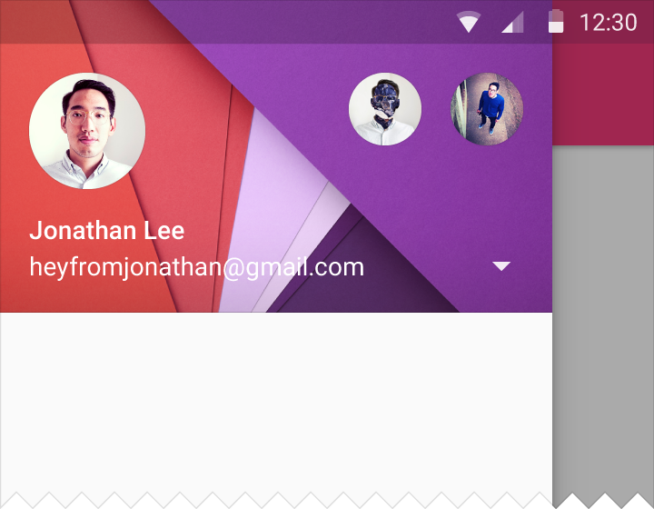  

## 简介 

导航制图工具似乎应该在[这里](http://goo.gl/w4FVWS)介绍。除了一些 [criticism](https://medium.com/@villainschorus/your-problem-goes-beyond-hamburgers-e0aae6a1576) 我也喜欢模式，所以我决定在我研究的几个应用程序上实现它。你在这里可以阅读到的仅仅是我对于它感兴趣的想法，希望能够帮助互相帮助互相学习。 

*这是三个出版物的第二版。看看第一章和第三章：* 

- [*Material设计下的导航制图工具选型* ](https://medium.com/@sotti/navigation-drawer-styling-under-material-design-f0767882e692)
- *Material 设计下的导航制图工具行为(很快出版)* 

*你可以从这里浏览关于导航制图工具的 Material 设计指南：* 

- [*导航制图工具模式*](http://www.google.com/design/spec/patterns/navigation-drawer.html)
- [*Material 设计的指标和关键路线* ](http://www.google.com/design/spec/layout/metrics-keylines.html#)
- [Toolbar 方法](http://www.google.com/design/spec/layout/structure.html#structure-toolbars)

## 初始
制图工具总是热门话题。当 Material 设计概念开始出现时，人们有一些[困惑](http://goo.gl/q3dnCI)，甚至[后来指南产生](https://plus.google.com/+SebastianoPoggi/posts/6MFgMeRLrrg)，概念也没有完全清晰。 

现在有[很棒的库](https://plus.google.com/+MikePenz/posts/Erwn9mDZszr)出现，甚至一些 [Google 代码](https://github.com/google/iosched)来查看•••但是如果你查看这些，有可能是因为你觉得[代码好玩](http://i3.kym-cdn.com/photos/images/facebook/000/234/765/b7e.jpg)。 

在这里我将要谈论制图工具的样式。它并没有覆盖全部你可以在指南中看到的样式，只是一些我观点中指出的东西。 

准备好了吗？ 

## 位置 

过去，Navigation Drawer 和 ActionBar 处于相同层次的视图中。 
 
 

随着模式演化，开始有一些不一致。当 Material 设计出现时，可以很清楚的看到这两部分不再处于视图的同一层次中。关于这点有[许多讨论](https://plus.google.com/+RomanNurik/posts/3G8zYvN5oRC)，[甚至更多](http://goo.gl/SHrQmd)，[但是 Google 没有给出太多有用的东西](http://goo.gl/FghQhb)，而现在导航制图工具的位置定义如下：  

*左侧导航制图工具跨屏幕的整个高度，制图工具处于状态栏下方。所有制图工具下的东西都被幕布遮住变暗。幕布下的内容仍然是可见的。* 

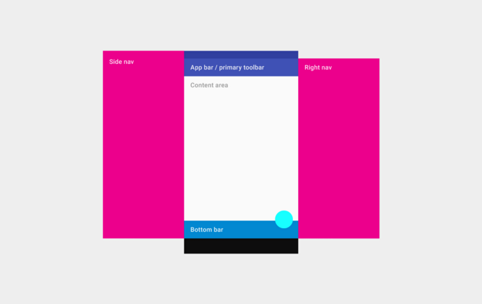

*注意图片中右侧的制图工具有些不同。* 

*注意：我假定你使用的是 [AppCompat](https://chris.banes.me/2014/10/17/appcompat-v21/)[工具栏](https://developer.android.com/reference/android/widget/Toolbar.html)。* 

由于工具栏是另一个视图层次结构，所以就像你处理其他视图一样，只是定位制图工具布局下的工具栏。 

如果你在一些 Google 应用程序中看到如下所示的东西，不用担心： 

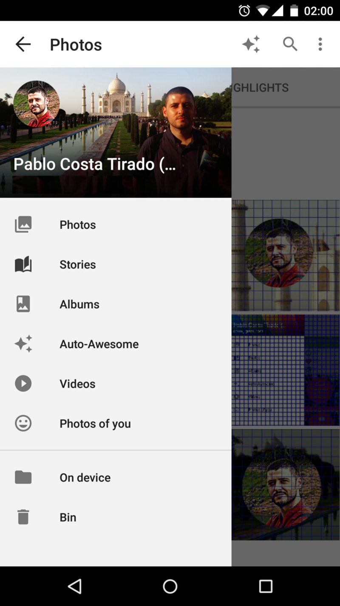 

Google+ 照片可能是最后一个制图工具没有在 actionBar/Toolbar 上的 Google 应用程序，我相信下次更新会修复这个问题。 
 
## 自旋条 

你还记得当打开制图工具时，在 actionBar/toolbar 出现的别致的图标动画吗？在 Holo 中，动画并不别致，但是 Material 设计使得动画看起来非常棒。 

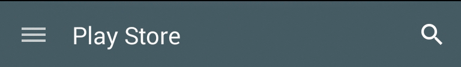 

我认为它首先出现在 Google 的 Play Store 中，然后多数开发人员和设计师都喜欢它。 

但是不久之后，在[动画](https://lh6.googleusercontent.com/-9oPeSA7FUkI/VOs530mLbLI/AAAAAAABapc/ekQNTZPXyoE/w499-h281-no/tumblr_inline_nk2y80nOF91rllljr.gif)上出现了制图工具，如前部分解释的那样。在当时是非常奇怪的，因为它也出现在 Google 的 Material 设计视频和商品推销功能中。 
 
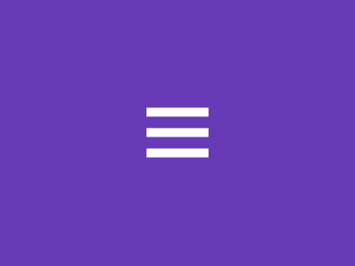 

我记得当迁移到 material 设计时，大多数人表现的像第一件要做的事是 burger/arrow 的事。在第一个 Google 实现中，制图工具不在工具栏的上方，且你也不会看到华丽的动画效果。指南出现之后，有一段*奇怪*的时刻，Google 应用程序做的正好与 Material 设计指南告诉我们的相反。而现在我写这篇文章时，Google 应用程序是遵循指南的，并且我希望不久以后看到全部应用程序中制图工具都在工具栏的上方。 

在我看来，那个设计决定实在是晚了。图标的动画已经默认的由 SDK 释放和激活。 

出于某种原因，即使布局之后，制图工具处于一切工具的上方，大多数 Google 应用程序仍然有动画(*注意：在写这一条目的过程中，Gmail 和 Inbox 已经停用了*)，即使你只能偶尔见到(如果你注意并且缓慢的移动制图工具就可以看到它)。这点让我难以接受，一旦你见到它，也不能视而不见。所以我决定把它关掉。 

当你第一次在 *DrawerArrowStyle* 中看到如下的选项时，看起来非常容易： 

[item name=”spinBars”>true](https://developer.android.com/reference/android/support/v7/mediarouter/R.attr.html#spinBars)

[它在 Android 开发者中定义如下](https://developer.android.com/reference/android/support/v7/appcompat/R.attr.html#spinBars)： 

>*在过渡期间条是否应该旋转。必须是一个布尔值，“true”或者“false”。 *

问题是它不起作用。如果你将它设置为“false”，那么条会一种奇怪的方式旋转。 

我发现禁用它的方法是覆盖 onDrawerSlide 方法。看看下面的 Gist linked。 

*由于图标动画隐约可见，因此没有理由继续保留它。如果你不留意就不会看见它，如果你留意并且看到了它，却不理解正在发生什么。* 

## 资料图片 

资料图片是圆形的。得到一个圆形的图像有不同的方法，但我始终记得 [Romain Guy ](https://plus.google.com/+RomainGuy/about)在[这篇文章](http://www.curious-creature.com/2012/12/11/android-recipe-1-image-with-rounded-corners/comment-page-1/)中谈到的方法。所以我决定使用 CircleImageView，它是基于 Romain Guy 的技术的，不会有错。我还没有检查 [Google IO 应用程序上使用的方法](https://github.com/google/iosched/blob/master/android/src/main/java/com/google/samples/apps/iosched/ui/widget/BezelImageView.java)，但是可能值得去看一看。 

在 Google Play Movies 和 Google Play Books 中的图像有一个白色的边框。其他 Google 应用程序中没有这个边框。Google+ 和 Hangouts 在工具栏中有资料图片，虽然它也有白色的边框。 
 
 

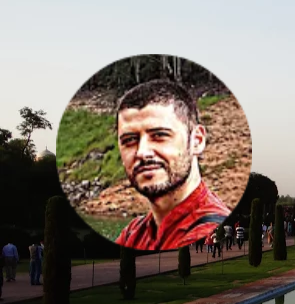 

*注意：*[*检查一下资料图片的大小*](https://medium.com/@sotti/navigation-drawer-styling-under-material-design-f0767882e692) 

这个资料图片是圆形的，通常没有边框。确保你的带有库的圆形图片是遵循Romain推荐的技术得到的。 

## 封面图片 

封面图片(不同于资料图片)，是 account/header 部分(这是上一部分，通常你可以在你的账户之间改变，看到你的显示名称，电子邮箱和你的资料图片)的背景。 

这个区域的文本是白色的，并且为了确保它可见，你可以应用前景或半透明的黑色覆盖封面图片。我尝试了不同的透明度，发现透明度为 40-50% 的黑色是不错的。你不想看不见照片，也不想使文本不可读。 

我所做的是在 FrameLayout 中应用前景。我不知道这是不是最好的方法，希望得到一些反馈。我没有可以切换的账户，对我来说，整个布局/部分是可点击的，带有触感反馈或 Lollipop 的连锁反应或全部。确保你使用 [centerCrop](https://developer.android.com/reference/android/widget/ImageView.ScaleType.html) 的 scaleType 来使它看起来更好。 

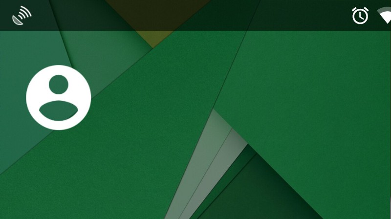 

如果你查看上面图片，制图工具是可见的，且在状态栏的下方。此刻我写这点时，Google 应用程序仍然处于迁移到这种模式的过程中。 Gmail, Inbox, Keep, Play Store 和 Hangouts 已经有这种布局，而其他的应用程序正在进行中。此刻，这只发生在运行在 Lollipop 和以上版本中的应用程序中。 

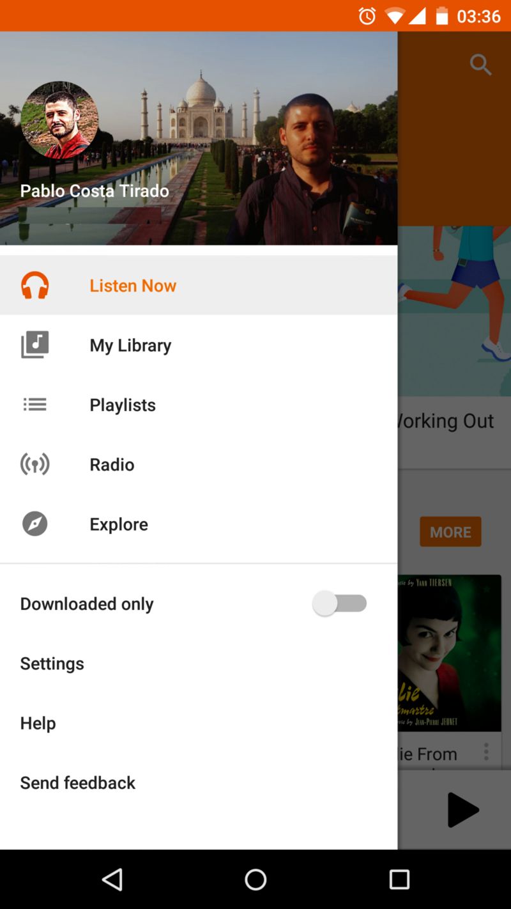

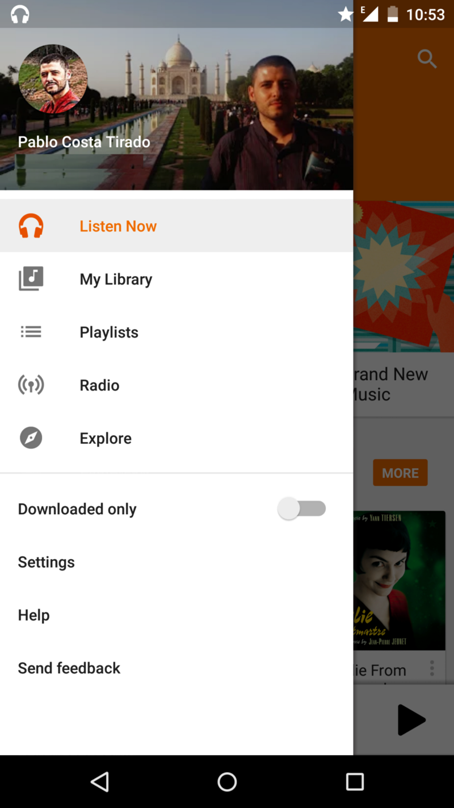 

尽管当前在 Play Store 的 Google IO 应用程序中，导航制图工具是完全错误的，但是它们有更好的代码，并且为下一版本的发布(看起来还需要一段时间...从现在开始到几个月后的 Google IO 会议之前可能一直更新)做好了准备。 

神奇的地方在 [Google ScrimInsets layout](http://goo.gl/07TJnm) 中。复制，粘贴，完成。你可以试着做。我觉得 Google 的员工会比我做的更好。看看下面的代码部分。看看要点中的代码，因为它也需要用到主题/样式。 

ScrimInsets 布局能否应用于低于 Lollipop 的版本中，我也不清楚。然而我知道将它用于 Kit Kat 中是可能的，但是 Google 不这样做。的确，“入侵”状态栏和/或导航栏不是 Lollipop 下的事，并且可能这就是其原因。 

*注意：*[*查看封面图片的大小*](https://medium.com/@sotti/navigation-drawer-styling-under-material-design-f0767882e692) 

*状态栏下的导航制图工具只会在 Lollipop 中出现。入侵状态栏或导航栏不 Lollipop 下的事，因此这可能就是不会发生的原因。*

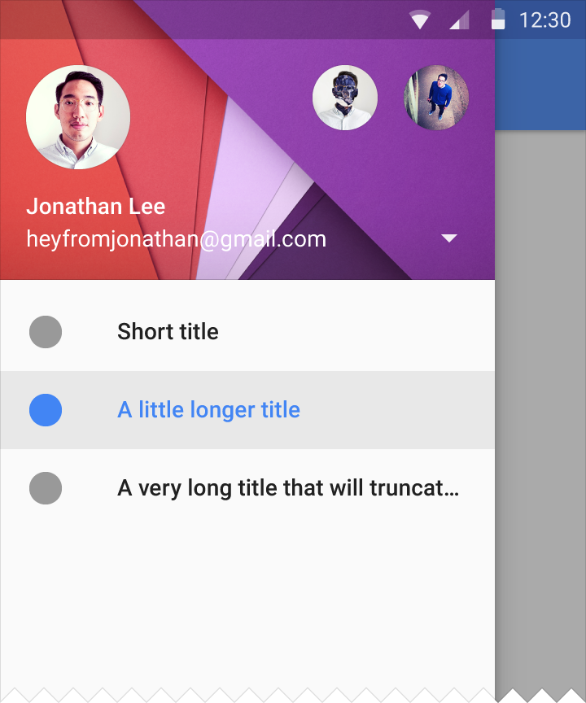 

当谈论到为制图工具中的主要行制订样式时，我们需要为每一行的每一个单元解决3个元素(背景，图标和文本)和3种不同的状态(默认，选中和按下)。并不是所有的东西都按照[说明](http://www.google.com/design/spec/patterns/navigation-drawer.html)来写，但是我们必须阅读说明，看看Google应用程序和其他看起来不错的应用程序，试图找出怎样能使它以Material 设计的方式看起来不错的方法。 

好的，现在让我们看看一些 Google 应用程序来收集一些线索。在接下来的图片中，第一行是默认的状态，第二行是选中的状态，第三行是按下的状态。 

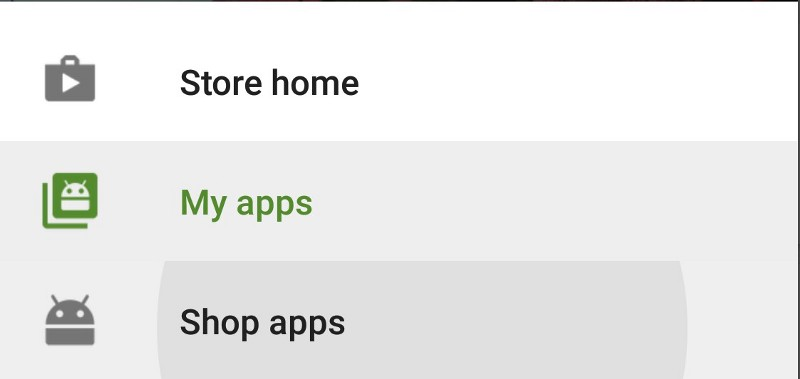 

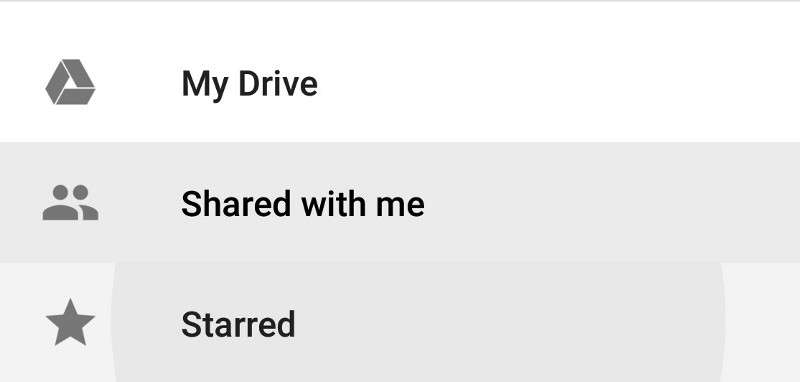 

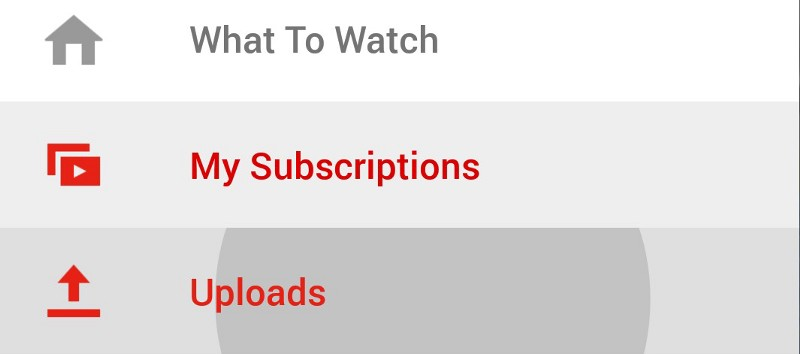 

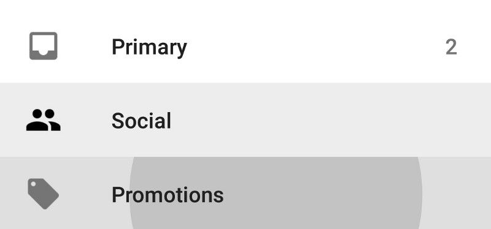 

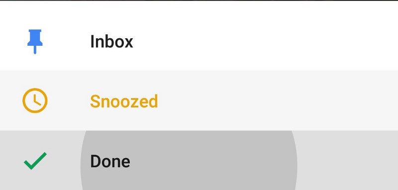 

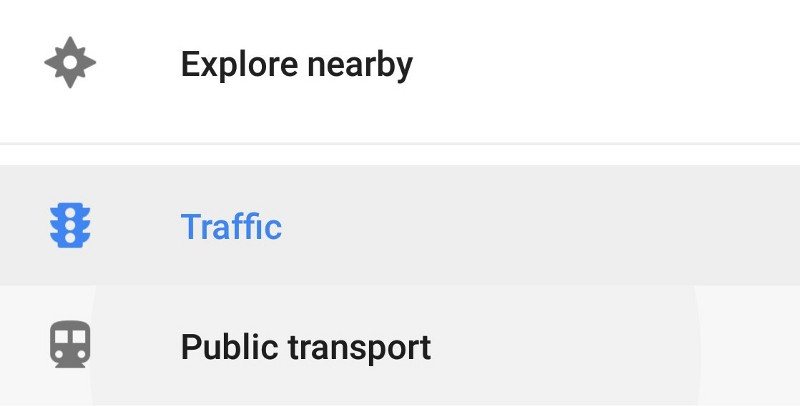 

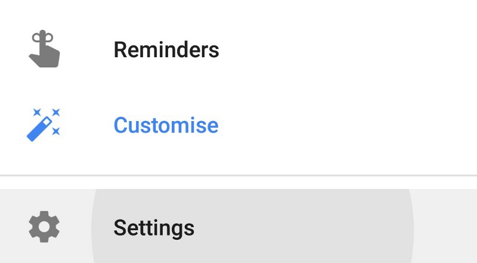 

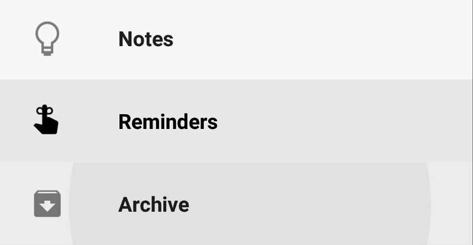 

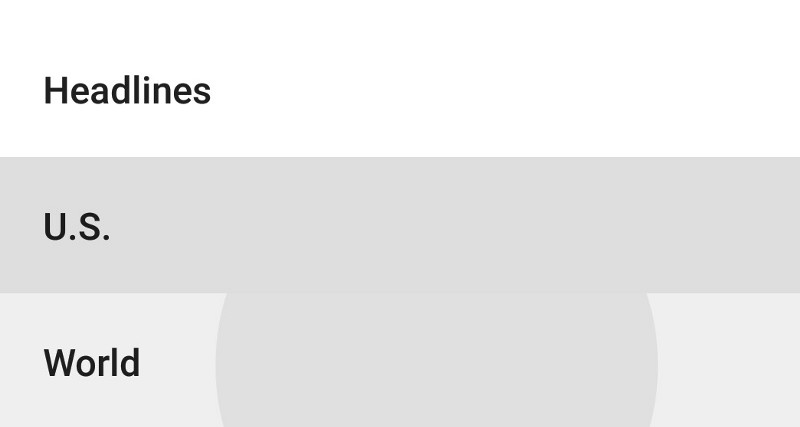 

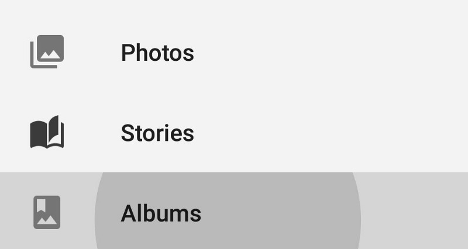 

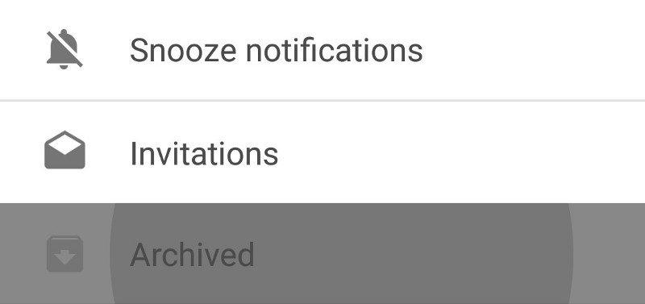 

以上所有图片看起来相似但是它们都不相同。总结： 

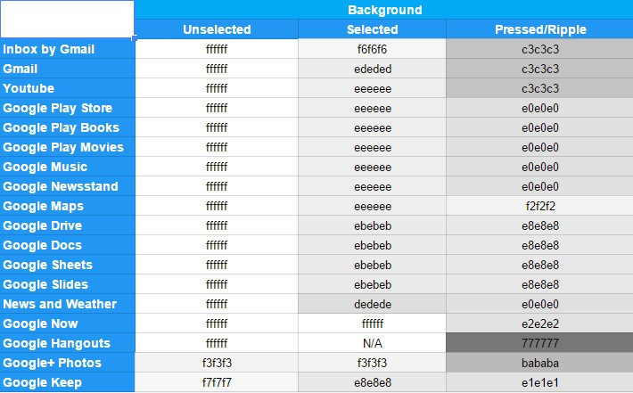 

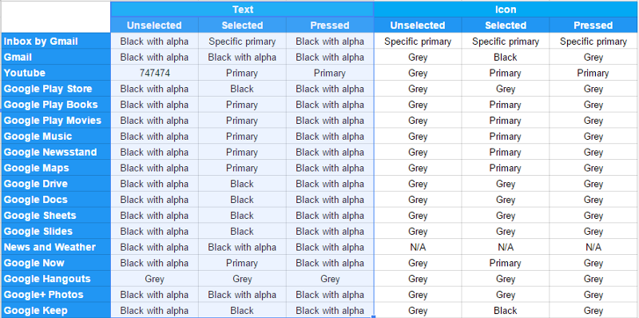 

*Google 应用程序看上去很一致，但是当你注意细节你会发现此刻就在我写这篇文章时，超过 10 个应用程序在为导航制图工具中可选的行项目制订样式。* 

- 经验法则 

经过一些尝试，以及查看指南和Google应用程序，这就是我提出的。 

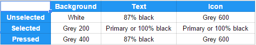 

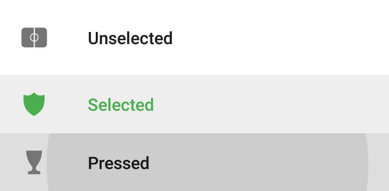 

## 如何实现 

我真的很想知道其他人是怎样实现的，这是我实现的方法。 

首先我为背景使用两个画板。一个用于 Lollipop 的 res/drawable-v21 及以上版本，另一个用于较低版本的 res/drawable。原因是连锁反应不低于 5.0。 

*只在 Lollipop 及以上版本中使用连锁反应。低于 5.0 的版本不支持连锁反应，更重要的是，不希望出现连锁反应。 *

你每次按下一行，无论是被选中的还是未被选中的，连锁反应就会出现。所以在 res/drawable-v21 中，你实际上有的是一个选择器，它带有几个包含连锁反应的项目。这是因为当按下被选中或未被选中的行时，我们想显示相同的连锁反应，但是未被选中的行的背景是白色，而被选中的行的背景是*grey_200*。 

 在 res/drawable，你所需的是一个选择器，它不带有取决于布局装态的连锁反应。 

## 图标 

在上个月我尝试的是避免同一图标有不同选颜色。所以我想到的是我所有图标都为白色。然后我应用了一个带有想使用的颜色的 tint，然后你就能得到你的有颜色的图标。这样做的好处是当你决定改变颜色时，你不需要每次都创建新的图标，[你可以从 Google 得到不同大小和不同颜色的图标](https://github.com/google/material-design-icons)，并且你可以在几秒钟之内为相同的图标设置不同的颜色，以此来找出哪一个是最好的。如果你为相同的图标使用不同的颜色，你还可以节省空间。如果你需要根据状态(按下，选中...)决定图标的颜色变化，你只需要在你的 tint 上设置一个[颜色状态列表](https://developer.android.com/guide/topics/resources/color-list-resource.html)。 

我是在[自定义视图中以编程的方式扩展 ImageView](https://github.com/Sottti/MaterialDesignNavDrawer/blob/master/app/src/main/java/com/demo/materialdesignnavdrawer/customViews/TintOnStateImageView.java)，因为颜色状态栏在 Kit Kat 及以下版本中不起作用(android：tint 在颜色下起作用，但是在颜色状态下不起作用)。 

看看下面联系的要点我是怎么做的。如果你有更好的选择或者发现了错误，请说明。 

## 页眉页脚行为 

这里的指导方针是相当灵活的。它基本上由你的设计决定。 

页眉部分(又名账户部分)有时固定，有时会出现一些可滚动。就你的设计而言，在我看来这应该是被固定的。制图工具看起来更好，它是一致的，是获取你的资料的最好方法。 

页脚部分(即设置和支持)可以被固定或者不被固定。如果你看看Google应用程序，有些是固定的，有些是在滚动条的底部。如果你不知道它们不能到达制图工具的底部，那么页脚只出现在主行之后。 

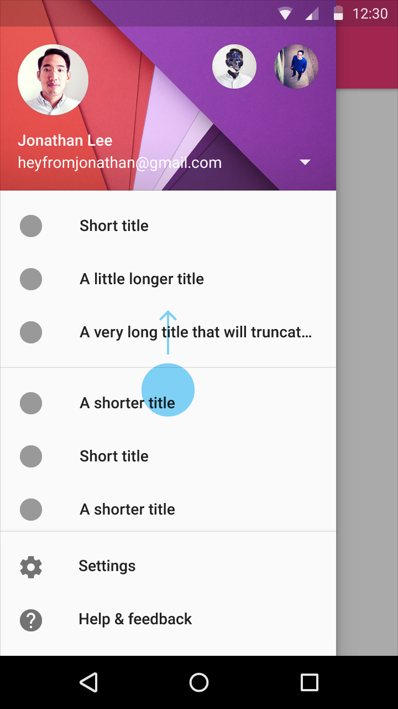 

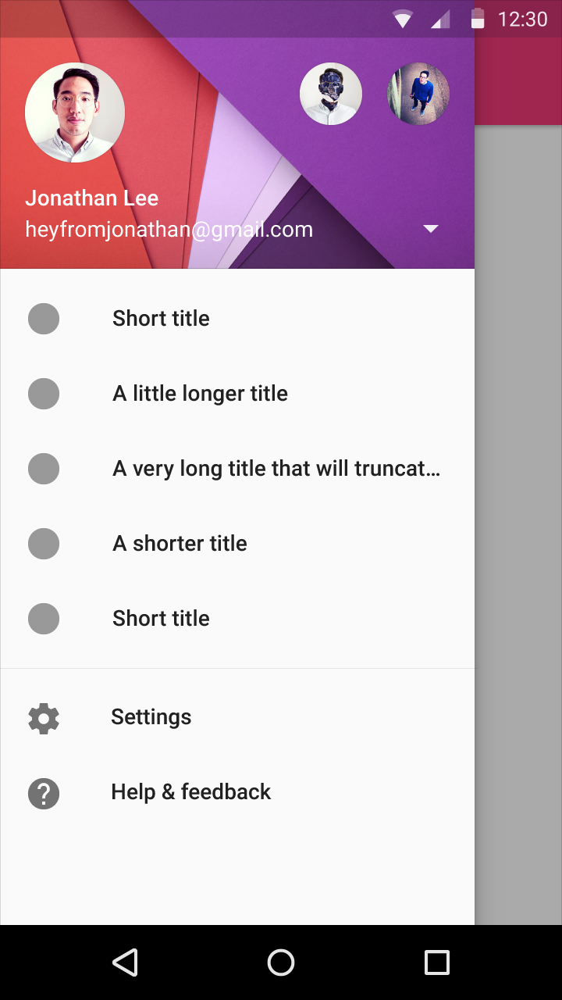 

在我看来,固定是最好的方法,但你可以做一些例外。例如当你固定页眉时,一些条目也就固定了,然后在制图工具中有一个可滚动的部分。如果滚动部分的空间很少以至于它看起来有些蠢笨(1 或 2 行),那么你可能就想获得更多的空间，而取消固定页脚是一个不错的选择。 

*页眉和页脚应该被固定，除非制图工具结构需要空间来达到良好的外观和行为。* 

由于制图工具上大量的选项，路径、结构...这里没有真正的经验法则。 

## 资源 

- [Google 官方 Material 设计图标](https://github.com/google/material-design-icons)
- [Material 设计颜色定义](http://www.google.com/design/spec/style/color.html) 

## 代码 

- [Github 上的项目](https://github.com/Sottti/MaterialDesignNavDrawer) 

## 总结 

这是关于制图工具的样式设置。知道你想要什么比做到需要的时间更多。 

如果你想知道怎么为制图工具设置样式，看看其他两篇文章。 

我希望收到一些评论，反馈或者其他什么都好。我写这篇文章是希望大家互相帮助互相学习。 

过得愉快！
