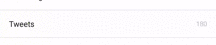
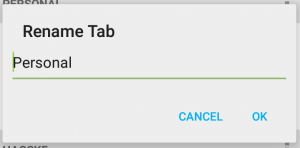
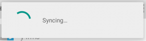
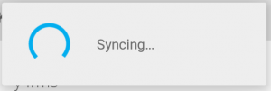
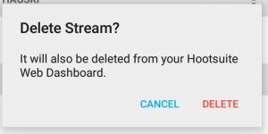
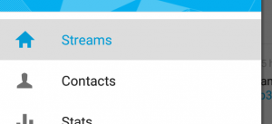

# Android Material 支持库：Electric Boogaloo的提示与技巧

如果你之前阅读过我[先前的博客文章](http://code.hootsuite.com/tips-and-tricks-for-android-material-support-library/)和链接的教程，那么你应该有这样一个应用程序，它使用Material 支持库，并且看起来非常得体。这篇文章的重点是帮你的设计增加一些亮点，并且让它更接近Google Material 设计指南。最好的部分是：这些设计不需要设计师或新的资产。  

  

## 连锁反应 

每个人都喜欢按钮上的以及使一切事物拥有反馈的令人满意的连锁反应。我将向您展示如何添加这个效果。注意连锁反应只会出现在运行 Lollipop 的设备中，而在以前的版本中呈现为一个静态的高亮区。 

### 按钮

大多数按钮是由几个画板组成的。一般来说有一个按键，正常版本中有用的代码如下：

/drawable/button.xml:  

```
    <selector xmlns:android="http://schemas.android.com/apk/res/android">
    		<item android:state_pressed="true" android:drawable="@drawable/button_pressed"/>
    		<item android:drawable="@drawable/button_normal"/>
    </selector> 
```

为了得到你的连锁反应，在 drawable-21 上重写你的按钮，在你的正常按钮上添加一个连锁反应效果。使用`?android:colorControlHighlight `可以使你添加的连锁反应与应用程序中内置的连锁反应颜色一致。

/drawable-21/button.xml:  

```
	<ripple xmlns:android="http://schemas.android.com/apk/res/android"
    		android:color="?android:colorControlHighlight">
    		<item android:drawable="@drawable/button_normal" />
    </ripple>   
```

 

如果你不喜欢默认的灰色，你可以指定在你的主题中`colorControlHighlight `的颜色。但是，对于这点我提出警示，因为它会偏离你应用程序的内容，并且几乎没有 Google 设计的应用程序会这样做。

### 可点击的视图 

如果你有一个视图，想给它添加一个连锁反应，那么应该怎么做呢?一种常见的情况是有几个可点击的项目的 LinearLayout 。你可以用`<ripple>`元素创建自己的画板，但是还有一种更简单的方法。只需要给`?attr/selectableItemBackground`设置背景。 

In XML: 

```
    <View
    	android:layout_width="wrap_content"
    	android:layout_height="wrap_content"
    	android:background="?attr/selectableItemBackground" /> 
In code: 

    int[] attrs = new int[]{R.attr.selectableItemBackground};
	TypedArray typedArray = getActivity().obtainStyledAttributes(attrs);
	int backgroundResource = typedArray.getResourceId(0, 0);
    view.setBackgroundResource(backgroundResource);   
```

 

如果你想使连锁反应来扩展之前的视图的边界，那么你就可以使用 `?attr/selectableItemBackgroundBorderless`。它与 ImageButtons 和部分大视图的较小的 Buttons 能很好的兼容。 

 

## 带有风格的对话框

当 AlertDialogs 和 ProgressDialogs 在 Lollipop 设备中运行时，AlertDialogs 和ProgressDialogs 与 material 设计应该自动显示不幸的是,除非你手动改变它们，否则它们就会呈现为默认的蓝绿色。如果你喜欢蓝绿色，那么就这样设置即可——但是我们可以很容易地使对话框与应用程序的主题相匹配。 

  
 
 

### 全部对话框

想让你的按钮适合你的主题非常简单，只需要创建一个风格，然后将它添加到你的主题中。在AlertDialog 中的按钮以及 ProgressDialog 中的 ProgressBar 的颜色是由 colorAccent 属性决定的。

styles.xml:  

```
    <style name="AlertDialogCustom" parent="Theme.AppCompat.Light.Dialog">
    	<item name="colorAccent">@color/primary</item>
    </style> 

themes.xml: 

    <style name="AppTheme" parent="Theme.AppCompat.Light.DarkActionBar">
    	<item name="colorPrimary">@color/primary</item>
    	<item name="colorPrimaryDark">@color/primary_dark</item>
    	<item name="colorAccent">@color/accent</item>
    	<item name="android:alertDialogTheme">@style/AlertDialogCustom</item>
    </style> 
```

 

 

### 破坏性的对话框
当[ Material设计指南 ](http://www.google.com/design/spec/material-design/introduction.html)首次发布时，其中包括一个为破坏性对话框的单独的设计。这个设计有一个红色的按钮，它是用来强调正在执行的操作具有破坏性的。要想实现这一功能，你可以在你的对话框主题中重写 buttonBarPositiveButtonStyle 属性： 

styles.xml: 

```
    <style name="AlertDialogCustom.Destructive">
    	<item name="android:buttonBarPositiveButtonStyle">@style/DestructiveButton</item>
	</style>
 
	style name="DestructiveButton"
        	parent="android:Widget.DeviceDefault.Button.Borderless">
    	<item name="android:textColor">@color/red</item>
    </style> 
```

想要为特定的 AlertDialog 使用这一风格，你需要在 AlertDialog.Builder 构造函数中指定一个主题： 
 


### 在每个平台上的Material 对话框
如果你想让你的对话框拥有跨所有 Android 版本的 Material 外观，你需要自定义对话框风格或库。我不喜欢白费力气做重复工作，所以我建议使用一个可用的库： 

- [https://github.com/afollestad/material-dialogs](https://github.com/afollestad/material-dialogs)
- [https://github.com/fengdai/AlertDialogPro/](https://github.com/fengdai/AlertDialogPro/)
- [https://github.com/drakeet/MaterialDialog](https://github.com/drakeet/MaterialDialog)

## 导航制图工具 

浏览 [Navigation Drawers](http://www.google.com/design/spec/patterns/navigation-drawer.html) 的 Material 设计部分，会为你设计 DrawerLayout 提供一个好的指南。它为得到一个基本的 Material 风格的制图工具提供了所需要的图纸填充、文本大小以及颜色。
### 文本颜色
指南指示，应为你选定的制图工具项目使用主要颜色或者黑色。你可以检测在代码中哪个项目被选中了或者哪个项目改变了文本颜色，但是还有一种更简单的方式。通过使用[ ColorStateList ](http://developer.android.com/guide/topics/resources/color-list-resource.html)，就可以指定当文本被选中或没被选中时的颜色。

color/menu_text.xml: 

and in your layout file: 

```
    <TextView
        	android:id="@+id/menu_text"
        	android:layout_width="match_parent"
        	android:layout_height="wrap_content"
        	style="@style/Text.Title"
        	android:textColor="@color/menu_selector" /> 
```

### 图标颜色
你也可以改变菜单图标的颜色使之与文本匹配。如果你使用 v-21 或更高的版本，就可以简单的设置 “android:tint” 属性，使它与之前的 ColorStateList 相同。但是，当你使用 Material 支持库时，你就需要更广泛的方案来解决这个问题。 

一个解决方案是每个图像有两个属性，一个是选中，一个是未选中。这是一个不错的解决方案，但是如果你想对图片编辑软件改变颜色或者得到一些使用经验，那么这两个属性都需要改变。一种编程的方法是通过 ColorFilter 来为你的图标上色：
 
```
iconView.setColorFilter(getResources().getColor(R.color.primary_dark)); 
```

[This](http://stackoverflow.com/questions/11095222/android-imageview-change-tint-to-simulate-button-click/18724834#18724834) Stack Overflow 向你展示了一种很好的方式来改变图标颜色，它是基于其状态，通过创建 ImageView 的一个子类实现的。你也可以重用你的 ColorStateList ，如使用 v-21 tint：

 

## 总结
让你的应用程序遵循 Google 的 Material 设计指南基本方针并不是特别困难的。许多事情甚至都不需要设计师。有了这些基础知识，你就可以学习更加复杂的概念，如 animation and elevation。 

浏览 Hootsuite 的新的 Android 设计，现在在 [Play Store](https://play.google.com/store/apps/details?id=com.hootsuite.droid.full&hl=en) 中可用。
