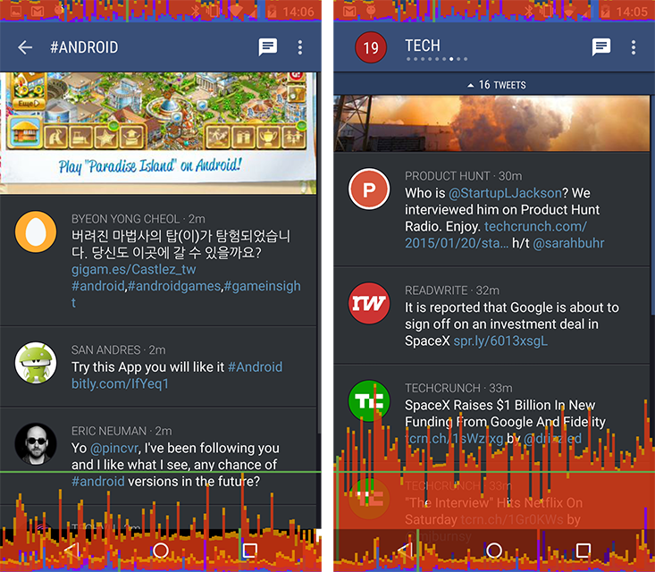
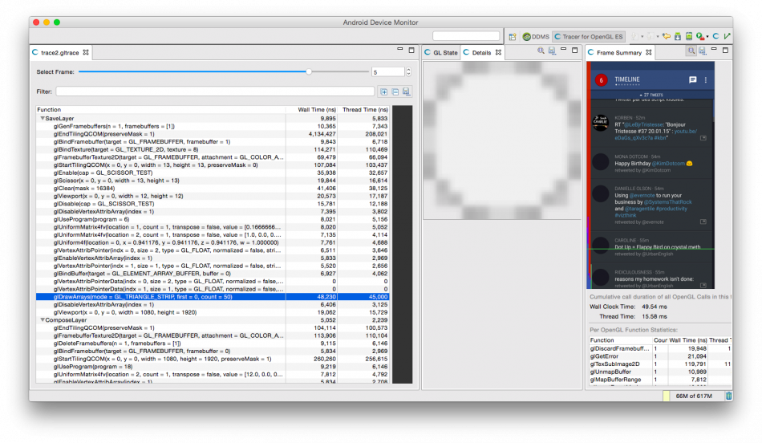
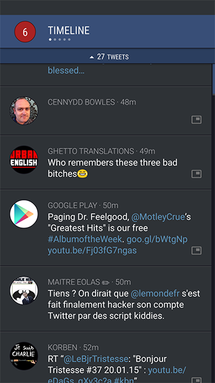

# Android性能案例追踪研究

两年前，我发表了一篇名为[Android性能案例研究](http://www.curious-creature.com/2012/12/01/android-performance-case-study/)的文章，帮助Andriod开发者理解哪些工具和技术可被用于识别、跟踪并解决性能问题。

这篇文章专注于一个推特客户端设计[Falcon Pro](https://play.google.com/store/apps/details?id=com.jv.materialfalcon)，它是由Joaquim Vergès开发的。Joaquim非常好，他允许我在我的文章中使用他的应用程序，并迅速解决我发现的所有问题。一切进展都非常顺利，直到Joaquim开始从头开始编写Falcon Pro 3。前不久Joaquim发行自己的新应用，他联系到我，因为他需要我帮助解决影响滚动的性能问题（再一次，我没有访问源代码）。

Joaquim使用了所有合适的工具，并能迅速排除那些没有产生问题的方面。例如，他发现过度拉大不是一个产生问题的原因。然而，他能够缩小问题到[ViewPager](http://developer.android.com/reference/android/support/v4/view/ViewPager.html)的使用方面。他发给我下面的截图：

Joaquim使用系统屏幕上的GPU分析工具来检测帧率下降。左边的屏幕截图显示了没有ViewPager的滚动时间线性能，右边的截图显示了带有一个 ViewPager的性能（他使用2014 Moto X捕捉到这一数据）。产生问题的根本原因似乎很明显。

我的第一个想法是看看ViewPager是否不明原因地[滥用硬件层](http://www.curious-creature.com/2013/09/13/optimizing-hardware-layers/)。观察到的性能问题可能是由于列表滚动的每一帧引起硬件层更新造成的。系统的[硬件层更新调试工具](http://www.curious-creature.com/2013/09/13/optimizing-hardware-layers/)没有发现任何问题。我仔细检查了HierarchyViewer，令人欣慰的是ViewPager的行为是正确的。

然后我准备使用另一个强大的、很少用的，叫做Tracer for OpenGL的工具。我[以前的文章](http://www.curious-creature.com/2012/12/01/android-performance-case-study/)讲述了如何使用这款工具的更多细节。你所需要知道的是，这个工具会收集所有的UI工具包发送到GPU的绘图指令。

>Android 4.3及以上版本：不幸的是，当我们在Android 4.3以上版本中引入绘图指令的重排和合并后，Tracer变得更加难以使用。这是一个非常有用的优化，但它可以防止Tracer获取分组视图指令。你可以通过使用以下指令禁用显示列表的优化来恢复以前版本中绘图指令的行为：

>读取OpenGL追踪：图中蓝色的指令是GL绘制像素到屏幕上。所有其他指令用于传输数据或设置状态，很容易被忽视。每次你点击一个蓝色的指令，Tracer将更新Details选项卡并在你点击执行指令后显示你当前的渲染目标的内容。你可以通过一个接一个地点击每一个蓝色的指令重建一帧。这就是我如何使用Tracer分析性能问题的过程。通过查看每一帧是如何渲染的，可以获得应用程序正在执行情况的很多见解。

在我仔细阅读了追踪收集到的Falcon Pro I滚动过程之后，我很惊讶地看到一系列块指令SaveLayer/ComposeLayer（点击图片看大图）：

这些块表明了临时硬件层的创建和组成。这些临时层是由Canvas.saveLayer()的不同变体创建的。当满足特定条件时，UI工具包使用 Canvas.saveLayer() 绘制alpha < 1（见View.setAlpha()）的Views：

- [getAlpha()](http://developer.android.com/reference/android/view/View.html#getAlpha()) 返回< 1的值
- [onSetAlpha()](http://developer.android.com/reference/android/view/View.html#onSetAlpha(int)) 返回false
- [getLayerType()](http://developer.android.com/reference/android/view/View.html#getLayerType()) 返回LAYER_TYPE_NONE
- [hasOverlappingRendering()](http://developer.android.com/reference/android/view/View.html#hasOverlappingRendering()) 返回true

Chet和我在一些介绍中解释了“为什么你应该[慎重的使用alpha](https://www.youtube.com/watch?v=vQZFaec9NpA&feature=youtu.be&t=29m51s)”。每次UI工具包必须使用临时层时，绘图指令会被发送到不同的渲染目标，以及切换渲染目标操作对GPU来说消耗很大。GPU使用平铺/递延架构（ImaginationTech的SGX、Qualcomm的Adreno等等）明显地被这种行为所伤害。例如Nvidia的直接渲染架构会适用的好一些。由于Joaquim 和我研究的Moto X 2014设备使用了Qualcomm Adreno GPU，使用多个临时的硬件层是出现我们所面临性能问题的最可能的根本原因。

因此，主要问题变成：是什么创造了这些临时层？Tracer 给我们提供了答案。如果你看一下Tracer的截图就可以发现，OpenGL操作的SaveLayer 组中唯一的绘图指令渲染的似乎是一个小渲染目标中的圆（使用工具放大的结果）。现在，让我们来看看应用程序的截图：

你看到顶部这些小圆圈了吗？那是一个ViewPager 指针，用于显示用户的位置。Joaquim使用了第三方程序库（我不记得是哪一个了）来绘制这些指针。有趣的是这个程序库如何绘制了该指针：当前页是一个白色的圆圈表示，在其他页面似乎是一个灰色的圆圈。我说“这似乎是一个灰色的”，是因为这些圆圈其实是半透明的白色圆圈。这个程序库为每一个圆圈使用View（这本身就是浪费），并调用setAlpha()改变它们的颜色。

这里有解决这个问题的几种解决方案：

- 使用一个自定义的“不活动的”颜色代替设置视图的透明度
- 从hasOverlappingRendering() 返回false，该框架将设置适当的alpha为你绘制
- 从onSetAlpha() 返回true，在绘制中设置一个alpha，用于绘制“灰色”圆圈

最简单的解决方法是第二个，但是它仅适用于API16以上。如果你必须支持老版本的Android，那么使用其他两种解决方案。我相信Joaquim会抛弃第三方程序库，改为使用他自己的指针。

我希望这篇文章能明确指出那些似乎是无辜和无害操作所引起的性能问题。所以请记住：不要做假设，而是要采取措施！