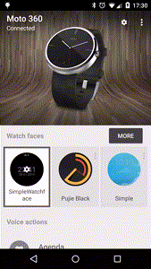

# 使用安卓Wear API创建watchface—第2部分

在该教程的[第一部分](http://catinean.com/2015/03/07/creating-a-watch-face-with-android-wear-api/)，已经涉及到创建一个数字的Android Wear watchface的基础知识。在这一部分中，将看到如何在Android Wear的移动应用中为其watchface添加一个面板设置。在学习完本文后，你将学会在你的移动设备上从Android Wear应用程序内部控制背景颜色、时间、日期和你的watchface的颜色。

为了建立腕表和移动设备之间的通信通道，你必须使用Google Play services中的[Wearable Data Layer API](https://developer.android.com/training/wearables/data-layer/index.html)。官方文件说明如下：

>因为这些API是专为手持设备和可穿戴设备之间的通信而设计的，这是仅有的一些API，你应该使用它们设置这些设备之间的通信。例如，不要尝试打开底层套接字创建一个通信信道。

在可穿戴数据层API的帮助下，你可以将将多种对象类型发送到你的设备上：

-	[DataItems](https://developers.google.com/android/reference/com/google/android/gms/wearable/DataItem) ——提供数据存储和自动同步
	
-	[Messages]——主要用于远程过程调用和单向请求
	
-	[Assets] ——用于发送二进制数据
	
对于通信渠道，我们将使用DataApi 来发送从移动设备到数据层的DataItems ，而watchface将接受任何修改。

## 创建移动设置界面

前面已经看到，我们将要使用的API是Google Play services的一部分，所以你必须在你的mobile/src/main/AndroidManifest.xml文件中 `<application>`标签之下指定一个meta-data实体：

```
<manifest xmlns:android="http://schemas.android.com/apk/res/android"  
  package="com.catinean.simpleandroidwatchface">

  ...

  <application
    android:allowBackup="true"
    android:label="@string/app_name"
    android:icon="@mipmap/ic_launcher"
    android:theme="@style/AppTheme">

    <meta-data
      android:name="com.google.android.gms.version"
      android:value="@integer/google_play_services_version" />

  </application>

</manifest>  
```   
 
下一步，在 mobile/src/main/java/your_package 中创建一个空的activity组件，这将作为你的watchface的activity组件设置。我们调用它的`SimpleWatchFaceConfigurationActivity`。为了让你的watchface认为该activity组件为设置activity组件，你必须在你的 mobile AndroidManifest.xml文件中指定一个`<intent-filter>`：

```
<manifest xmlns:android="http://schemas.android.com/apk/res/android"  
  package="com.catinean.simpleandroidwatchface">

  ...

  <application
    android:allowBackup="true"
    android:label="@string/app_name"
    android:icon="@mipmap/ic_launcher"
    android:theme="@style/AppTheme">

    <activity
      android:name="com.catinean.simpleandroidwatchface.SimpleWatchFaceConfigurationActivity"
      android:label="@string/app_name"
      android:theme="@style/AppTheme">
      <intent-filter>
        <action android:name="com.catinean.simpleandroidwatchface.CONFIG_DIGITAL" />
        <category android:name="com.google.android.wearable.watchface.category.COMPANION_CONFIGURATION" />
        <category android:name="android.intent.category.DEFAULT" />
      </intent-filter>
    </activity>

    <meta-data
      android:name="com.google.android.gms.version"
      android:value="@integer/google_play_services_version" />
  </application>
</manifest>  
```


正如你看到的，你必须为你的intent filter和类别指定一个自定义的 < action >。在我们的例子中，动作名称是由封装名称和配置字符串：com.catinean.simpleandroidwatchface.CONFIG_DIGITAL组成的。
在穿戴模块方面，你必须在 AndroidManifest.xml 文件中为你之前创建的`<service>`实体增加一个额外的`<meta-data>`字段：

```
<manifest xmlns:android="http://schemas.android.com/apk/res/android"  
  package="com.catinean.simpleandroidwatchface">

  ...

  <application
    android:allowBackup="true"
    android:label="@string/app_name"
    android:icon="@mipmap/ic_launcher"
    android:theme="@android:style/Theme.DeviceDefault">

    <service
      android:name=".SimpleWatchFaceService"
      android:label="@string/app_name"
      android:permission="android.permission.BIND_WALLPAPER">

      ...

      <meta-data
        android:name="com.google.android.wearable.watchface.companionConfigurationAction"
        android:value="com.catinean.simpleandroidwatchface.CONFIG_DIGITAL" />

      <intent-filter>
        <action android:name="android.service.wallpaper.WallpaperService" />
        <category android:name="com.google.android.wearable.watchface.category.WATCH_FACE" />
      </intent-filter>
    </service>
  </application>
</manifest>  
```

让我们看一下，元数据`值`如何对应于activity组件的动作`名称`。

现在，activity组件是空的。为了用户能够配置watchface背景颜色、日期和时间的颜色，我们用两个实体填充它。它的布局很简单，形成一个带有两个元素的`LinearLayout` （一个用于背景颜色，另一个用于日期和时间的颜色）。该 mobile/src/main/res/layout/activity_configuration.xml 文件将会是如下的形式：

```
   <?xml version="1.0" encoding="utf-8"?>  
<RelativeLayout xmlns:android="http://schemas.android.com/apk/res/android"  
  android:layout_height="match_parent"
  android:layout_width="match_parent">

  <android.support.v7.widget.Toolbar
    android:id="@+id/toolbar"
    android:layout_width="match_parent"
    android:layout_height="wrap_content"
    android:minHeight="?attr/actionBarSize"
    style="@style/MyActionBarStyle" />

  <LinearLayout
    android:layout_below="@+id/toolbar"
    android:orientation="vertical"
    android:layout_width="match_parent"
    android:layout_height="match_parent"
    android:divider="@drawable/delimiter"
    android:showDividers="middle"
    android:paddingStart="16dp"
    android:paddingEnd="16dp">

    <RelativeLayout
      android:id="@+id/configuration_background_colour"
      android:layout_width="match_parent"
      android:layout_height="wrap_content"
      android:background="@drawable/selector_preference_background"
      android:paddingTop="16dp"
      android:paddingBottom="16dp">

      <TextView
        android:layout_width="wrap_content"
        android:layout_height="wrap_content"
        android:layout_alignParentStart="true"
        android:textColor="@android:color/black"
        android:textSize="18sp"
        android:text="@string/background_colour" />

      <View
        android:id="@+id/configuration_background_colour_preview"
        android:layout_width="30dp"
        android:layout_height="30dp"
        android:layout_alignParentEnd="true" />

    </RelativeLayout>

    <RelativeLayout
      android:id="@+id/configuration_time_colour"
      android:layout_width="match_parent"
      android:layout_height="wrap_content"
      android:background="@drawable/selector_preference_background"
      android:paddingTop="16dp"
      android:paddingBottom="16dp">

      <TextView
        android:layout_width="wrap_content"
        android:layout_height="wrap_content"
        android:layout_alignParentStart="true"
        android:textSize="18sp"
        android:textColor="@android:color/black"
        android:text="@string/date_and_time_colour" />

      <View
        android:id="@+id/configuration_date_and_time_colour_preview"
        android:layout_width="30dp"
        android:layout_height="30dp"
        android:layout_alignParentEnd="true" />

    </RelativeLayout>
  </LinearLayout>
</RelativeLayout>  
```

再回到activity组件，我们希望在对话框中显示各元素颜色的名称。为此，我们将创建一个简单的ColourChooserDialog ，其将包含一个简单的颜色列表，当用户点击一个activity组件的元素时，它将进行显示。

该`ColourChooserDialog`将会是这样的：
    

```
package com.catinean.simpleandroidwatchface;

import android.app.Activity;  
import android.app.AlertDialog;  
import android.app.Dialog;  
import android.app.DialogFragment;  
import android.content.DialogInterface;  
import android.os.Bundle;

public class ColourChooserDialog extends DialogFragment {

    private static final String ARG_TITLE = "ARG_TITLE";
    private Listener colourSelectedListener;

    public static ColourChooserDialog newInstance(String dialogTitle) {
        Bundle arguments = new Bundle();
        arguments.putString(ARG_TITLE, dialogTitle);
        ColourChooserDialog dialog = new ColourChooserDialog();
        dialog.setArguments(arguments);
        return dialog;
    }

    @Override
    public void onAttach(Activity activity) {
        super.onAttach(activity);
        colourSelectedListener = (Listener) activity;
    }

    @Override
    public Dialog onCreateDialog(Bundle savedInstanceState) {
        String title = getArguments().getString(ARG_TITLE);
        AlertDialog.Builder builder = new AlertDialog.Builder(getActivity());
        builder.setTitle(title)
                .setItems(R.array.colors_array, new DialogInterface.OnClickListener() {
                    public void onClick(DialogInterface dialog, int which) {
                        String[] colours = getResources().getStringArray(R.array.colors_array);
                        colourSelectedListener.onColourSelected(colours[which], getTag());
                    }
                });
        return builder.create();
    }

    interface Listener {
        void onColourSelected(String colour, String tag);
    }
}
```

你可以看到，这是一个简单的`DialogFragment` ，其通过一个字符串数组`R.array.colors_array`显示`AlertDialog`列表（获取更多关于对话框的一般信息，你可以在这里[阅读](http://developer.android.com/guide/topics/ui/dialogs.html)官方文档）。

该字符串数组只是mobile/src/main/res/values/arrays.xml的内部资源：

```
<?xml version="1.0" encoding="utf-8"?>  
<resources>  
  <string-array name="colors_array">
    <item name="black">Black</item>
    <item name="white">White</item>
    <item name="red">Red</item>
    <item name="green">Green</item>
    <item name="cyan">Cyan</item>
    <item name="magenta">Magenta</item>
  </string-array>
</resources>   
```

为了通知所选择的颜色的活动，该对话框提供了一个接口。因为将有多个对话框的创建（一个用于背景颜色和一个用于日期和时间的颜色），而且必须要通过它们的`tag`来区分。

`SimpleWatchFaceConfigurationActivity` 会是这样的：

```
public class SimpleWatchFaceConfigurationActivity extends ActionBarActivity implements ColourChooserDialog.Listener {

    private static final String TAG_BACKGROUND_COLOUR_CHOOSER = "background_chooser";
    private static final String TAG_DATE_AND_TIME_COLOUR_CHOOSER = "date_time_chooser";

    private View backgroundColourImagePreview;
    private View dateAndTimeColourImagePreview;

    @Override
    protected void onCreate(Bundle savedInstanceState) {
        super.onCreate(savedInstanceState);
        setContentView(R.layout.activity_configuration);

        Toolbar toolbar = (Toolbar) findViewById(R.id.toolbar);
        setSupportActionBar(toolbar);
        getSupportActionBar().setDisplayHomeAsUpEnabled(true);

        findViewById(R.id.configuration_background_colour).setOnClickListener(new View.OnClickListener() {
            @Override
            public void onClick(View v) {
                ColourChooserDialog.newInstance(getString(R.string.pick_background_colour))
                        .show(getFragmentManager(), TAG_BACKGROUND_COLOUR_CHOOSER);
            }
        });

        findViewById(R.id.configuration_time_colour).setOnClickListener(new View.OnClickListener() {
            @Override
            public void onClick(View v) {
                ColourChooserDialog.newInstance(getString(R.string.pick_date_time_colour))
                        .show(getFragmentManager(), TAG_DATE_AND_TIME_COLOUR_CHOOSER);
            }
        });

        backgroundColourImagePreview = findViewById(R.id.configuration_background_colour_preview);
        dateAndTimeColourImagePreview = findViewById(R.id.configuration_date_and_time_colour_preview);

    }

    @Override
    public boolean onOptionsItemSelected(MenuItem item) {
        if (item.getItemId() == android.R.id.home) {
            finish();
            return true;
        }

        return super.onOptionsItemSelected(item);
    }

    @Override
    public void onColourSelected(String colour, String tag) {

        if (TAG_BACKGROUND_COLOUR_CHOOSER.equals(tag)) {
            backgroundColourImagePreview.setBackgroundColor(Color.parseColor(colour));
        } else {
            dateAndTimeColourImagePreview.setBackgroundColor(Color.parseColor(colour));
        }
    }
}
```

如果现在你就要在`穿戴`设备运行wear （穿戴）`模块`，然后是移动设备上的mobile（移动） 模块，导航到 `Android Wear`应用程序，你将能够访问activity组件的设置。



## 发送数据到API的数据层

现在，我们能够捕捉到选定的颜色，现在该去了解我们是如何将它发送到API的数据层的。为了连接和发送数据，你将不得不使用`GoogleApiClient` 类。在activity组件中的`onCreate()`，我们创建了对象，使用 `onStart()`我们连接到了数据层，使用`onStop()`断开连接。我们增强的activity组件将会是这样的：

```
public class SimpleWatchFaceConfigurationActivity extends ActionBarActivity implements ColourChooserDialog.Listener,  
        GoogleApiClient.ConnectionCallbacks,
        GoogleApiClient.OnConnectionFailedListener {

    ... 
    private static final String TAG = "SimpleWatchface";

    private GoogleApiClient googleApiClient;

    @Override
    protected void onCreate(Bundle savedInstanceState) {

       ...

        googleApiClient = new GoogleApiClient.Builder(this)
                .addConnectionCallbacks(this)
                .addOnConnectionFailedListener(this)
                .addApi(Wearable.API)
                .build();

        ...
    }

    @Override
    protected void onStart() {
        super.onStart();
        googleApiClient.connect();
    }

   ...

    @Override
    public void onConnected(Bundle bundle) {
        Log.d(TAG, "onConnected");
    }

    @Override
    public void onConnectionSuspended(int i) {
        Log.e(TAG, "onConnectionSuspended");
    }

    @Override
    public void onConnectionFailed(ConnectionResult connectionResult) {
        Log.e(TAG, "onConnectionFailed");
    }

    @Override
    protected void onStop() {
        if (googleApiClient != null && googleApiClient.isConnected()) {
            googleApiClient.disconnect();
        }
        super.onStop();
    }
}
```

为了确保连接，我加了一些相应的回调日志。一个同步数据层由两元素组成：

- `payload`: 实际要发送的数据。
	 
- `path`：你要发送数据项的一个唯一的标识符（`path必须以正斜杠开头`，例如"/simple_watch_face_config"）。
我们将在 `PutDataMapRequest`的帮助下发送数据，这为我们提供了一个类似于行为的关键值。`onColourSelected(String colour, String tag)`方法将会是这样的：

```
@Override
public void onColourSelected(String colour, String tag) {  
     PutDataMapRequest putDataMapReq = PutDataMapRequest.create("/simple_watch_face_config");

     if (TAG_BACKGROUND_COLOUR_CHOOSER.equals(tag)) {
         backgroundColourImagePreview.setBackgroundColor(Color.parseColor(colour));
         putDataMapReq.getDataMap().putString("KEY_BACKGROUND_COLOUR", colour);
     } else {
         dateAndTimeColourImagePreview.setBackgroundColor(Color.parseColor(colour));
         putDataMapReq.getDataMap().putString("KEY_DATE_TIME_COLOUR", colour);
     }

     PutDataRequest putDataReq = putDataMapReq.asPutDataRequest();
     Wearable.DataApi.putDataItem(googleApiClient, putDataReq);
}
```

你会看到在指定的path 上如何创建一个`PutDataRequest` ，每次收到一个颜色，就用一个特定的key填充映射。最后，在`Wearable.DataApi.putDataItem(googleApiClient, putDataReq)`方法的帮助下发送请求。

现在，我们能够发送颜色，必须在可穿戴模型中对它们进行处理，具体是在先前创建的`SimpleWatchFaceService`里处理。

## 在SIMPLEWATCHFACESERVICE中处理接收到的配置

回到可穿戴模型，我们必须处理`SimpleWatchFaceService`中之前通过`SimpleWatchFaceConfigurationActivity` 发来的配置信息。

正如在配置activity组件中所做的那样，为了与数据层API同步，必须首先通过一个`GoogleApiClient `对象连接到它。当watchface是可见时，我们将开始连接到API；当watchface是不可见的时，将端口与API的连接。你的`SimpleWatchFaceService` 将会是这样：

```
public class SimpleWatchFaceService extends CanvasWatchFaceService {

    ...

    private class SimpleEngine extends CanvasWatchFaceService.Engine implements
            GoogleApiClient.ConnectionCallbacks, GoogleApiClient.OnConnectionFailedListener {

        ...

        private GoogleApiClient googleApiClient;

        @Override
        public void onCreate(SurfaceHolder holder) {
            ...
            googleApiClient = new GoogleApiClient.Builder(SimpleWatchFaceService.this)
                    .addApi(Wearable.API)
                    .addConnectionCallbacks(this)
                    .addOnConnectionFailedListener(this)
                    .build();
        }

        ...

        @Override
        public void onVisibilityChanged(boolean visible) {
            super.onVisibilityChanged(visible);
            if (visible) {
                ...
                googleApiClient.connect();
            } else {
                ...
                releaseGoogleApiClient();
            }

            ...
        }

        private void releaseGoogleApiClient() {
            if (googleApiClient != null && googleApiClient.isConnected()) {
                googleApiClient.disconnect();
            }
        }

        ...

        @Override
        public void onConnected(Bundle bundle) {
            Log.d(TAG, "connected GoogleAPI");
        }

        @Override
        public void onConnectionSuspended(int i) {
            Log.e(TAG, "suspended GoogleAPI");
        }

        @Override
        public void onConnectionFailed(ConnectionResult connectionResult) {
            Log.e(TAG, "connectionFailed GoogleAPI");
        }

        @Override
        public void onDestroy() {
            ...
            releaseGoogleApiClient();

            super.onDestroy();
        }
    }
}
```

我们在`SimpleEngine` 的 `onCreate()`方法中创建了`GoogleApiClient`对象，当watchface是可见的时进行连接，当watchface是不可见的时释放客户端。

下一步，当移动activity组件的背景颜色和日期、时间颜色的值改变以及每次watch face连接到数据层时，我们想要得到通知。为了实现这个功能，不得不使用：

-	`DataApi.DataListener`——每次改变数据层的某些数据时，将会获得通知。

-	`ResultCallback`——每次googleApiClient 连接时，它将会通知我们。

```
public class SimpleWatchFaceService extends CanvasWatchFaceService {

    ...

    private class SimpleEngine extends CanvasWatchFaceService.Engine implements
            GoogleApiClient.ConnectionCallbacks, GoogleApiClient.OnConnectionFailedListener {

        ...

        private GoogleApiClient googleApiClient;

        @Override
        public void onCreate(SurfaceHolder holder) {
            ...
            googleApiClient = new GoogleApiClient.Builder(SimpleWatchFaceService.this)
                    .addApi(Wearable.API)
                    .addConnectionCallbacks(this)
                    .addOnConnectionFailedListener(this)
                    .build();
        }

        ...

        @Override
        public void onVisibilityChanged(boolean visible) {
            super.onVisibilityChanged(visible);
            if (visible) {
                ...
                googleApiClient.connect();
            } else {
                ...
                releaseGoogleApiClient();
            }

            ...
        }

        private void releaseGoogleApiClient() {
            if (googleApiClient != null && googleApiClient.isConnected()) {
                Wearable.DataApi.removeListener(googleApiClient, onDataChangedListener);
                googleApiClient.disconnect();
            }
        }

        ...

        @Override
        public void onConnected(Bundle bundle) {
            Log.d(TAG, "connected GoogleAPI");
            Wearable.DataApi.addListener(googleApiClient, onDataChangedListener);
            Wearable.DataApi.getDataItems(googleApiClient).setResultCallback(onConnectedResultCallback);
        }

        private final DataApi.DataListener onDataChangedListener = new DataApi.DataListener() {
            @Override
            public void onDataChanged(DataEventBuffer dataEvents) {
                for (DataEvent event : dataEvents) {
                    if (event.getType() == DataEvent.TYPE_CHANGED) {
                        DataItem item = event.getDataItem();
                        processConfigurationFor(item);
                    }
                }

                dataEvents.release();
                invalidateIfNecessary();
            }
        };

        private void processConfigurationFor(DataItem item) {
            if ("/simple_watch_face_config".equals(item.getUri().getPath())) {
                DataMap dataMap = DataMapItem.fromDataItem(item).getDataMap();
                if (dataMap.containsKey("KEY_BACKGROUND_COLOUR")) {
                    String backgroundColour = dataMap.getString("KEY_BACKGROUND_COLOUR");
                    watchFace.updateBackgroundColourTo(Color.parseColor(backgroundColour));
                }

                if (dataMap.containsKey("KEY_DATE_TIME_COLOUR")) {
                    String timeColour = dataMap.getString("KEY_DATE_TIME_COLOUR");
                    watchFace.updateDateAndTimeColourTo(Color.parseColor(timeColour));
                }
            }
        }

        private final ResultCallback<DataItemBuffer> onConnectedResultCallback = new ResultCallback<DataItemBuffer>() {
            @Override
            public void onResult(DataItemBuffer dataItems) {
                for (DataItem item : dataItems) {
                    processConfigurationFor(item);
                }

                dataItems.release();
                invalidateIfNecessary();
            }
        };

        @Override
        public void onConnectionSuspended(int i) {
            Log.e(TAG, "suspended GoogleAPI");
        }

        @Override
        public void onConnectionFailed(ConnectionResult connectionResult) {
            Log.e(TAG, "connectionFailed GoogleAPI");
        }

        @Override
        public void onDestroy() {
            ...
            releaseGoogleApiClient();

            super.onDestroy();
        }
    }
}
```

我们可以看到，每次watch face可见时，连接到数据层，一旦连接后，增加两个监听器。数据层每次发生变化时，`onDataChangedListener` 将得到通知；当服务连接时，`onConnectedResultCallback` 将得到通知。在这两种情况下，我们想处理接收到的`DataItem - processConfigurationFor(DataItem)`。在处理Items时，为了抓到发送的值，使用path (`/simple_watch_face_config`)和 关联到每一项的keys （在`SimpleWatchFaceConfigurationActivity`中定义了这些keys ）。一旦项目被识别，传递它们到`SimpleWatchFace` 以更新颜色：

-	`updateBackgroundColourTo(int colour)`：负责更新背景颜色
	
-	`updateDateAndTimeColourTo(int colour)`：负责更新数据和时间的颜色
	
```
 public class SimpleWatchFace {  
    ...

    private static final int DATE_AND_TIME_DEFAULT_COLOUR = Color.WHITE;
    private static final int BACKGROUND_DEFAULT_COLOUR = Color.BLACK;

    private int backgroundColour = BACKGROUND_DEFAULT_COLOUR;
    private int dateAndTimeColour = DATE_AND_TIME_DEFAULT_COLOUR;

    public static SimpleWatchFace newInstance(Context context) {
        Paint timePaint = new Paint();
        timePaint.setColor(DATE_AND_TIME_DEFAULT_COLOUR);
        timePaint.setTextSize(context.getResources().getDimension(R.dimen.time_size));
        timePaint.setAntiAlias(true);

        Paint datePaint = new Paint();
        datePaint.setColor(DATE_AND_TIME_DEFAULT_COLOUR);
        datePaint.setTextSize(context.getResources().getDimension(R.dimen.date_size));
        datePaint.setAntiAlias(true);

        Paint backgroundPaint = new Paint();
        backgroundPaint.setColor(BACKGROUND_DEFAULT_COLOUR);

        return new SimpleWatchFace(timePaint, datePaint, backgroundPaint, new Time());
    }

    SimpleWatchFace(Paint timePaint, Paint datePaint, Paint backgroundPaint, Time time) {
        this.timePaint = timePaint;
        this.datePaint = datePaint;
        this.backgroundPaint = backgroundPaint;
        this.time = time;
    }

    public void draw(Canvas canvas, Rect bounds) {
        time.setToNow();
        canvas.drawRect(0, 0, bounds.width(), bounds.height(), backgroundPaint);

        ...
    }

    public void updateDateAndTimeColourTo(int colour) {
        dateAndTimeColour = colour;
        timePaint.setColor(colour);
        datePaint.setColor(colour);
    }

    public void updateBackgroundColourTo(int colour) {
        backgroundColour = colour;
        backgroundPaint.setColor(colour);
    }

    ...
}
```

最后剩下的是处理环境模式。在环境模式中，会默认设置为黑色和白色的颜色。

```
@Override
public void onAmbientModeChanged(boolean inAmbientMode) {  
    super.onAmbientModeChanged(inAmbientMode);
    watchFace.setAntiAlias(!inAmbientMode);
    watchFace.setShowSeconds(!isInAmbientMode());

    if (inAmbientMode) {
        watchFace.updateBackgroundColourToDefault();
        watchFace.updateDateAndTimeColourToDefault();
    } else {
        watchFace.restoreBackgroundColour();
        watchFace.restoreDateAndTimeColour();
    }

    invalidate();

    startTimerIfNecessary();
}

每次进入环境模式我们更新默认的颜色,当它存在环境模式,我们必须恢复其选择的颜色:

```
public class SimpleWatchFace {  
    ...
    public void updateBackgroundColourToDefault() {
        backgroundPaint.setColor(BACKGROUND_DEFAULT_COLOUR);
    }

    public void updateDateAndTimeColourToDefault() {
        timePaint.setColor(DATE_AND_TIME_DEFAULT_COLOUR);
        datePaint.setColor(DATE_AND_TIME_DEFAULT_COLOUR);
    }

    public void restoreDateAndTimeColour() {
        timePaint.setColor(dateAndTimeColour);
        datePaint.setColor(dateAndTimeColour);
    }

    public void restoreBackgroundColour() {
        backgroundPaint.setColor(backgroundColour);
    }
}
```

现在你可以开始测试端到端的全部配置。首先在你的腕表上运行可穿戴模块，然后是手机上的移动模块。跳到你手机上的 Android Wear 应用程序，你可以选择安装腕表和访问它的设置屏幕。从这里你可以改变背景以及日期和时间的颜色。

