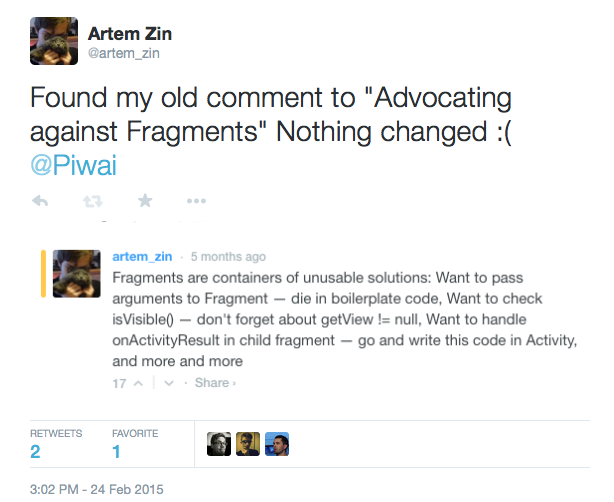
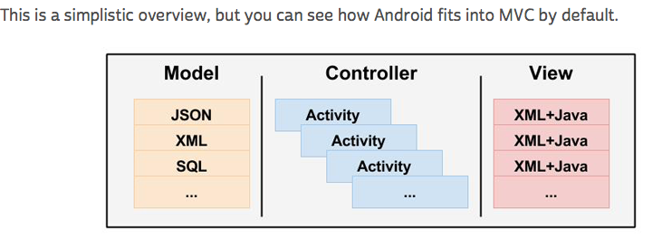

# MVC / MVP中的M -模型

你好，亲爱的读者，希望你也是Android开发者。

去年，Android Fragments遇到了很多麻烦，越来越多的开发者谈论他们遇到的问题，来自Square（一如既往）的伙计有一个解决方案——Flow和Mortar。今天我找到了我之前的评论“[Advocating Against Android Fragments](https://corner.squareup.com/2014/10/advocating-against-android-fragments.html)”。

我找到这篇评论是因为我看了Android周报的专栏：“[一项有关Flow和Mortar的调查](https://www.bignerdranch.com/blog/an-investigation-into-flow-and-mortar/)”。

我不想谈论[Flow](https://github.com/square/flow) 和[Mortar](https://github.com/square/mortar) （只是读了手册、专栏并尝试使用它们）。我想大家能注意到一个`非常小的事情`。

这是来自Android周报专栏评论的图片：

不幸的是，很多开发者确实看到这样的`模态`（Model） 层。

`Model不是JSON 或 XML 或 SQL`（顺便说一下，它是查询语言）。

JSON、XML等只是数据格式，`而不是Model`。它是你的`entities`的一个代表。

`Model` 是一个操纵这些实体的层、类、对象。

>问：在`许多`应用程序中我们能看到什么？

>答：`Spaghetti code`，当所有的带有300多行代码的“业务逻辑”被置入画面中和/或Fragments（碎片）或现在被植入Flow & Mortar的呈现者。类似于`RxJava` 的一个流行解决方案将反馈代码！（实际上，这比callbackhelled代码更好。）

## 我想说什么呢？请创建模态。

### 步骤如下：

`例如：你需要从你的API中获得用户列表`。

当你看到A/F/P，它是画面/ Fragment（碎片）/呈现者。

1、创建一些用户实体表示，类或接口（在Java中） ——用户

2、根据要求的数据格式写（或使用自动生成的）解析器，例如JSON或XML等等

3、在你的A/F/P（画面/碎片/呈现者）中写一个API调用。

4、现在从你的A/F/P中`删除`所有的API调用。

5、思考步骤3中的有关问题。

如果你经常写类似于API调用的东西，直接在你的A/F/P中访问Database / ContentProvider / SharedPreferences，请停止这样做。

### 为什么说在A/F/P中写这类代码是不好的习惯，这里有很多原因：

1、`难以测试`，因为你必须实例化A/ F / P实例，模仿它的状态，只是执行一些有用的代码。当然Android开发者中很少有人（2%）的写测试…

2、迟早`你会打破一个最重要的规则：“不要写重复的代码”`，因为之后你需要在应用程序的另一个位置做同样的事情。我敢保证。

3、当你需要切换到其他REST框架（Retrofit？）、HTTP客户端（OkHttp？）、数据库（Realm?）、Parser（Gson?）或另一个流行的框架，你将不得不改变很多的A / F / P类，然后测试它们，再次测试它们，再次测试……（现在你会考虑测试单元）。

4、`阅读超过300行的代码，尤其是在其中变更类是很困难的`，消耗了大量可以用在更有用的事情上的时间，比如生活。没有人喜欢意大利面条式的代码，但很多人都写这样的代码。

不幸的是，即使来自谷歌的人也会用这样不好的习惯方式编写应用程序，只是从d.android.com 或AOSP 或 Google I/O应用程序源代码中就可以看到这样的代码样本。

### 解决方案是模态层

从API获得用户列表的更好的变体：
1、创建一些用户实体表示，类或接口（在Java中）——用户

2、根据要求的数据格式写（或使用自动生成的）解析器，例如JSON或XML等等。

3、`创建模态类`，例如UserModel

4、在UserModel中创建一个方法，类似于“getUsers()”，执行API调用和解析并返回结果，我建议使用RxJava的Observable模式，因为它是非常灵活的、漂亮的，但是你可以使用回调机制，或者其他你想要使用的。

5、现在只需要在你的A/F/P中创建一个实例，并向它要一个用户列表！

6、祝你今天过得开心☺

### 为什么它比A / F / P中所做的同样事情要好？

1、`你可以很容易地添加或改变行为`：添加缓冲层（例如通过数据库），使额外的数据转换（当API改变时，等等）或在某一个地方的任何其他额外的行为。

2、`你可以在应用程序中的许多地方很容易地使用相同的模型`，而不需要重复写代码。

3、`你的A/F/P将会比较小`，大约平均需要150–200的代码。

4、`您可以为模型创建测试单元` 。

5、`你可以使用Dependency Injection` 注入模型到你的A/F/P中，使代码更好、更简洁。

6、代码整洁。

这就是全部内容，希望你的生活会变得更好。

注：本专栏可应用于任何类型的开发，如客户端：iOS、Windows Phone 或 Backend等等。但我想谈论的是Android的开发，因为它是我们工作中遇到的一个非常现实的问题。

