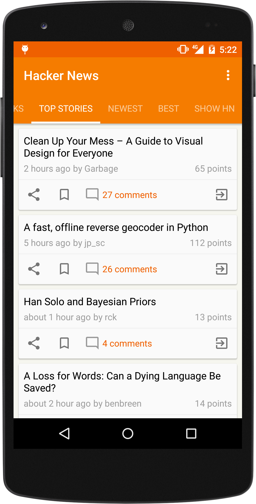
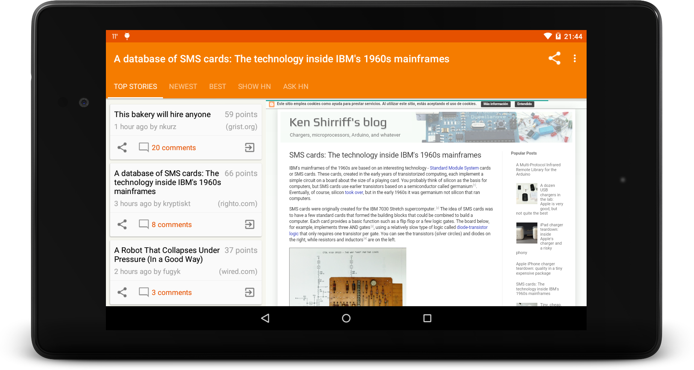
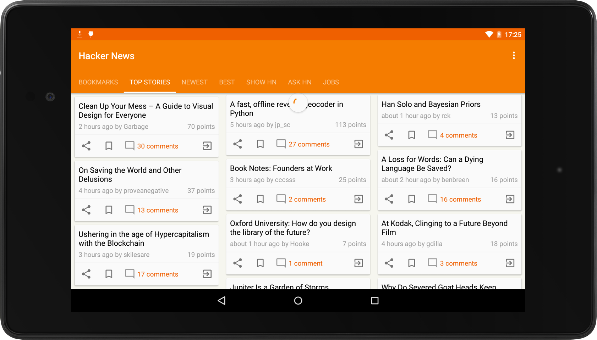
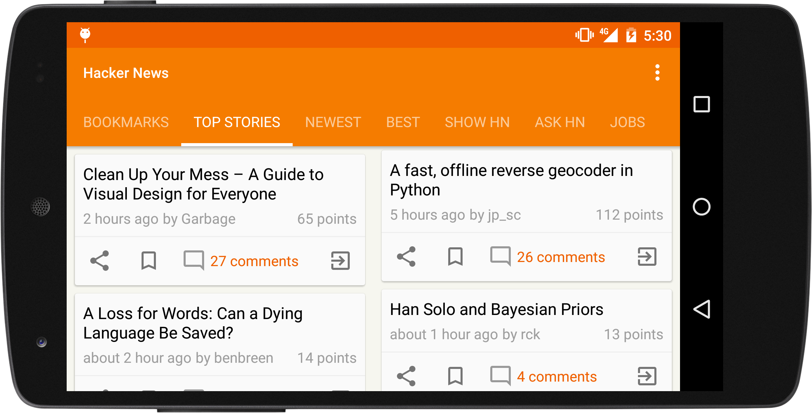
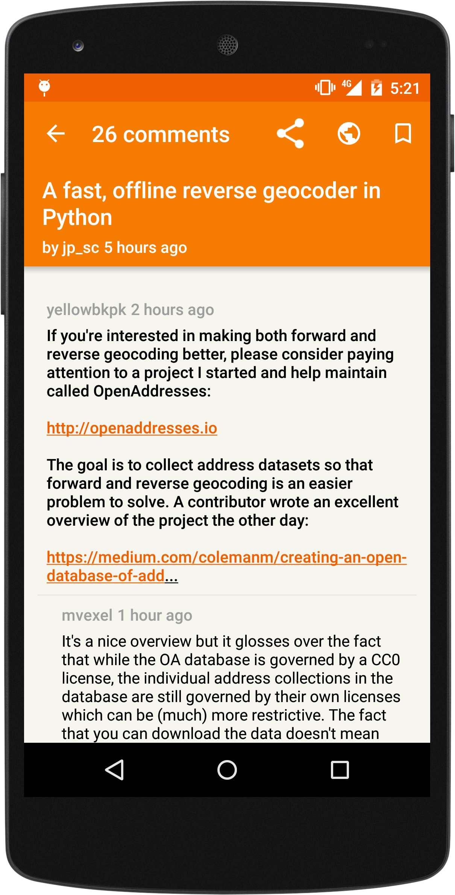

# Yahnac:RxJava Firebase&内容提供

你可能会问`Yahnac`是什么?是一个[黑客新闻](https://news.ycombinator.com/)客户端,因为黑客新闻客户端需求远远不够!

[黑客新闻](https://news.ycombinator.com/)是一个专注于计算机科学和创业的社会新闻网站，由创业公司孵化器[Y Combinator](https://www.ycombinator.com/)负责运行。一般来说,可提交内容被定义为“可以满足求知欲的任何内容”。

不久前Y Combinator宣布了黑客新闻[API](https://github.com/HackerNews/API)。最令人兴奋的消息此API使用[Firebase](https://www.firebase.com/)。

在功能方面,`Yahnac允许阅读所有黑客新闻内容`。最重要的是,`你可以添加书签并长期保持`。

如果你对`Yahnac`感兴趣,请继续阅读!

## A confession to make

我喜欢[Loader](http://developer.android.com/guide/components/loaders.html),[内容提供商](http://developer.android.com/guide/topics/providers/content-providers.html)及其样板。没有必要争论是否是最佳解决方案,明显不是。

几个月前[RxJava](https://github.com/ReactiveX/RxJava) 在[Novoda](http://novoda.com/)之间逐渐流行起来。像[数字音乐厅](https://play.google.com/store/apps/details?id=com.novoda.dch)等应用已经开发出来,成效显著。

我很庆幸自己拥有 [Benjamin Augustin](http://uk.droidcon.com/2014/sessions/rx-fy-all-the-things/), [Volker Leck ](https://twitter.com/devisnik)和[Antonio Bertucci](https://twitter.com/mr_archano)等出色的同事。

遵循以上原则，我使用`Rx`和`Firebase`把所有框架特定解决方案组合起来。

## 体系结构
　　　　
原理很简单,数据如何从网络提取的具体方式不用考虑，只需考虑数据库存储路径即可。在网络层使用`Rx`，数据层使用[SQlite](https://www.sqlite.org/)，UI层使用`Loaders`即可实现这些需求。

根据目前应用的API，可能需要检索到第501个 `Firebase`实例，以显示[500 top stories](https://github.com/HackerNews/API#new-and-top-stories)的列表。一个调用将检索Top Stories页面所有项目的ID，然后需要对这些ID的每一个进行另一个调用，并从新闻项目中检索数据。

`Rx`似乎是一个解决这一切问题的完美候选方法，它的积极性方法可以处理所有的递归调用和线程的无缝连接。它还允许操作数据，并提供数据库层所需求的输出。这个输出将是[ContentValues](http://developer.android.com/reference/android/content/ContentValues.html)，其为一种 `ContentProvider`需求。

在UI层面，当使用`ContentProvider`时，它可以非常容易地决定如何显示内容。 [CursorLoader](http://developer.android.com/reference/android/content/CursorLoader.html)允许检索含有所需数据的 [Cursor](http://developer.android.com/reference/android/database/Cursor.html)，这将非常有意义！

这里只需再进行一步，而且这是解决[RecyclerView](https://developer.android.com/reference/android/support/v7/widget/RecyclerView.html) 和`Cursor`之间不兼容问题的方法。在下面的专栏里我会深入探讨到实际的实现细节和问题，如果你有兴趣，敬请关注。

## 支持不同形式的因素

我对关于该UI和它在不同形式的因素中的样式有一些疑虑。在最开始的时候，我考虑使用Multi Pane，但是在使用了该应用一段时间后，我感觉有些地方不合理。

在格局上，导览不是非常清晰，所以我决定使用一个类似于Etsy 的`Staggered Grid`制作比较流行的背景。

同样，智能手机的用户界面将能够适应从一列变为两列的情况。

## 我们生活在一个物质的世界里

现如今，没有一个不包含有[Material Design principles](http://www.google.com/design/spec/material-design/introduction.html)的得体的应用程序被推出，在[talking](https://speakerdeck.com/malmstein/what-material-design-means-to-android) 和[presenting](https://speakerdeck.com/malmstein/material-animations) 它之后，我也不可能有不同的观点。

大多数文章都显示在WebView中，WebView没有预留很多空间用于过渡和花哨的动画显示。该应用程序没有图片，因此不能添加漂亮的[Palette](https://developer.android.com/reference/android/support/v7/graphics/Palette.html) ，这不是最好的情况吗？

然而，材料不仅仅是动画和颜色。也可以很方便地使用像`字体`、`空间`和`波动`等方面，形成一个很大的差异。

另一个特点是，所有的材料应用表明目前是`快速返回模式`。这是一个不错的想法，使用滚动可以让用户享受到更多的内容。

## 还有更多内容即将到来

该应用程序并没有完成，其中还有几个我想增加的特点，比如能够发布一条消息或回复评论。你还有更好的提议吗？请告诉我！该程序的源码可以从[GitHub](https://github.com/malmstein/yahnac)获得，欢迎所有的PRs。

